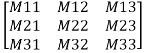
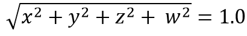

# SENSOR\_CATEGORY\_ORIENTATION

The SENSOR\_CATEGORY\_ORIENTATION category contains sensors that provide information about physical orientation. Compasses provide navigational orientation, such as those based on magnetic north. Inclinometers measure slope or elevation. Distance sensors measure the proximity of some object to the sensor.

**Platform-Defined Sensor Types**

This category includes the following platform-defined sensor types.

| Sensor type                                                                                                                                                                                                                                                                                                                      | Description                                                                                                                                                                                                                                                                                                               |
|:---------------------------------------------------------------------------------------------------------------------------------------------------------------------------------------------------------------------------------------------------------------------------------------------------------------------------------|:--------------------------------------------------------------------------------------------------------------------------------------------------------------------------------------------------------------------------------------------------------------------------------------------------------------------------|
| <dl> <dt>**SENSOR\_TYPE\_AGGREGATED\_DEVICE\_ORIENTATION**</dt> <dt></dt> </dl>                       | Specifies the current device orientation by returning a Quaternion and, in some cases, a rotation matrix. (The rotation matrix is optional.)                                                                                                                                                                    |
| <dl> <dt>**SENSOR\_TYPE\_AGGREGATED\_QUADRANT\_ORIENTATION**</dt> <dt></dt> </dl>                 | Specifies the current device orientation in degrees.                                                                                                                                                                                                                                                            |
| <dl> <dt>**SENSOR\_TYPE\_AGGREGATED\_SIMPLE\_DEVICE\_ORIENTATION**</dt> <dt></dt> </dl> | Specifies the device orientation as an enumeration. (This type specifies the device orientation using one of four general quadrants: 0 degrees, 90-degrees counter clockwise, 180-counter clockwise, and 270-degrees counter clockwise. It also indicates the face-up or face down orientation of the device.)  |
| <dl> <dt>**SENSOR\_TYPE\_COMPASS\_1D**</dt> <dt>{A415F6C5-CB50-49D0-8E62-A8270BD7A26C}</dt> </dl>                                           | One-axis compasses.                                                                                                                                                                                                                                                                                             |
| <dl> <dt>**SENSOR\_TYPE\_COMPASS\_2D**</dt> <dt>{15655CC0-997A-4D30-84DB-57CABA3648BB}</dt> </dl>                                           | Two-axis compasses.                                                                                                                                                                                                                                                                                             |
| <dl> <dt>**SENSOR\_TYPE\_COMPASS\_3D**</dt> <dt>{76B5CE0D-17DD-414D-93A1-E127F40BDF6E}</dt> </dl>                                           | Three-axis compasses.                                                                                                                                                                                                                                                                                           |
| <dl> <dt>**SENSOR\_TYPE\_DISTANCE\_1D**</dt> <dt>{5F14AB2F-1407-4306-A93F-B1DBABE4F9C0}</dt> </dl>                                        | One-axis distance sensors.                                                                                                                                                                                                                                                                                      |
| <dl> <dt>**SENSOR\_TYPE\_DISTANCE\_2D**</dt> <dt>{5CF9A46C-A9A2-4E55-B6A1-A04AAFA95A92}</dt> </dl>                                        | Two-axis distance sensors.                                                                                                                                                                                                                                                                                      |
| <dl> <dt>**SENSOR\_TYPE\_DISTANCE\_3D**</dt> <dt>{A20CAE31-0E25-4772-9FE5-96608A1354B2}</dt> </dl>                                        | Three-axis distance sensors.                                                                                                                                                                                                                                                                                    |
| <dl> <dt>**SENSOR\_TYPE\_INCLINOMETER\_1D**</dt> <dt>{B96F98C5-7A75-4BA7-94E9-AC868C966DD8}</dt> </dl>                            | One-axis inclinometers.                                                                                                                                                                                                                                                                                         |
| <dl> <dt>**SENSOR\_TYPE\_INCLINOMETER\_2D**</dt> <dt>{AB140F6D-83EB-4264-B70B-B16A5B256A01}</dt> </dl>                            | Two-axis inclinometers.                                                                                                                                                                                                                                                                                         |
| <dl> <dt>**SENSOR\_TYPE\_INCLINOMETER\_3D**</dt> <dt>{B84919FB-EA85-4976-8444-6F6F5C6D31DB}</dt> </dl>                            | Three-axis inclinometers.                                                                                                                                                                                                                                                                                       |

**Platform-Defined Data Fields**

Platform-defined property keys for this category are based on SENSOR\_DATA\_TYPE\_ORIENTATION\_GUID:

{1637D8A2-4248-4275-865D-558DE84AEDFD}

This category includes the following platform-defined data fields.

| Data field name and PID                                                                                                                                                                                                                                                                                                                                                                                        | Description                                                                                                                                                                                                                                                                                                                                                                                                                                                                                                                                                                                                                                                                                                                                                                                                                                                                                                                                                                                                                                                                                        |
|:---------------------------------------------------------------------------------------------------------------------------------------------------------------------------------------------------------------------------------------------------------------------------------------------------------------------------------------------------------------------------------------------------------------|:---------------------------------------------------------------------------------------------------------------------------------------------------------------------------------------------------------------------------------------------------------------------------------------------------------------------------------------------------------------------------------------------------------------------------------------------------------------------------------------------------------------------------------------------------------------------------------------------------------------------------------------------------------------------------------------------------------------------------------------------------------------------------------------------------------------------------------------------------------------------------------------------------------------------------------------------------------------------------------------------------------------------------------------------------------------------------------------------------|
| <dl> <dt>**SENSOR\_DATA\_TYPE\_ANGULAR\_VELOCITY\_X\_DEGREES\_PER\_SECOND**</dt> <dt>(PID = 10)</dt> </dl>                                                | **VT\_R8**  Gyrometer x-axis velocity, in degrees per second.                                                                                                                                                                                                                                                                                                                                                                                                                                                                                                                                                                                                                                                                                                                                                                                                                                                                                                                                                                                                                  |
| <dl> <dt>**SENSOR\_DATA\_TYPE\_ANGULAR\_VELOCITY\_Y\_DEGREES\_PER\_SECOND**</dt> <dt>(PID = 11)</dt> </dl>                                                | **VT\_R8**  Gyrometer y-axis velocity, in degrees per second.                                                                                                                                                                                                                                                                                                                                                                                                                                                                                                                                                                                                                                                                                                                                                                                                                                                                                                                                                                                                                  |
| <dl> <dt>**SENSOR\_DATA\_TYPE\_ANGULAR\_VELOCITY\_Z\_DEGREES\_PER\_SECOND**</dt> <dt>(PID = 12)</dt> </dl>                                                | **VT\_R8**  Gyrometer z-axis velocity, in degrees per second.                                                                                                                                                                                                                                                                                                                                                                                                                                                                                                                                                                                                                                                                                                                                                                                                                                                                                                                                                                                                                  |
| <dl> <dt>**SENSOR\_DATA\_TYPE\_TILT\_X\_DEGREES**</dt> <dt>(PID = 2) </dt> </dl>                                                                                                                        | **VT\_R4**  Inclinometer x-axis angle, in degrees.                                                                                                                                                                                                                                                                                                                                                                                                                                                                                                                                                                                                                                                                                                                                                                                                                                                                                                                                                                                                                             |
| <dl> <dt>**SENSOR\_DATA\_TYPE\_TILT\_Y\_DEGREES**</dt> <dt>(PID = 3) </dt> </dl>                                                                                                                        | **VT\_R4**  Inclinometer y-axis angle, in degrees.                                                                                                                                                                                                                                                                                                                                                                                                                                                                                                                                                                                                                                                                                                                                                                                                                                                                                                                                                                                                                             |
| <dl> <dt>**SENSOR\_DATA\_TYPE\_TILT\_Z\_DEGREES**</dt> <dt> (PID = 4) </dt> </dl>                                                                                                                       | **VT\_R4**  Inclinometer z-axis angle, in degrees.                                                                                                                                                                                                                                                                                                                                                                                                                                                                                                                                                                                                                                                                                                                                                                                                                                                                                                                                                                                                                             |
| <dl> <dt>**SENSOR\_DATA\_TYPE\_DISTANCE\_X\_METERS**</dt> <dt> (PID = 8) </dt> </dl>                                                                                                              | **VT\_R4**  X-axis distance, in meters.                                                                                                                                                                                                                                                                                                                                                                                                                                                                                                                                                                                                                                                                                                                                                                                                                                                                                                                                                                                                                                        |
| <dl> <dt>**SENSOR\_DATA\_TYPE\_DISTANCE\_Y\_METERS**</dt> <dt>(PID = 9) </dt> </dl>                                                                                                               | **VT\_R4**  Y-axis distance, in meters.                                                                                                                                                                                                                                                                                                                                                                                                                                                                                                                                                                                                                                                                                                                                                                                                                                                                                                                                                                                                                                        |
| <dl> <dt>**SENSOR\_DATA\_TYPE\_DISTANCE\_Z\_METERS**</dt> <dt>(PID = 10) </dt> </dl>                                                                                                              | **VT\_R4**  Z-axis distance, in meters.                                                                                                                                                                                                                                                                                                                                                                                                                                                                                                                                                                                                                                                                                                                                                                                                                                                                                                                                                                                                                                        |
| <dl> <dt>**SENSOR\_DATA\_TYPE\_MAGNETIC\_FIELD\_STRENGTH\_X\_MILLIGAUSS**</dt> <dt>(PID = 19)</dt> </dl>                                                    | **VT\_R8**  Magnetometer x-axis field strength, in milligauss.                                                                                                                                                                                                                                                                                                                                                                                                                                                                                                                                                                                                                                                                                                                                                                                                                                                                                                                                                                                                                 |
| <dl> <dt>**SENSOR\_DATA\_TYPE\_MAGNETIC\_FIELD\_STRENGTH\_Y\_MILLIGAUSS**</dt> <dt>(PID = 20)</dt> </dl>                                                    | **VT\_R8**  Magnetometer y-axis field strength, in milligauss.                                                                                                                                                                                                                                                                                                                                                                                                                                                                                                                                                                                                                                                                                                                                                                                                                                                                                                                                                                                                                 |
| <dl> <dt>**SENSOR\_DATA\_TYPE\_MAGNETIC\_FIELD\_STRENGTH\_Z\_MILLIGAUSS**</dt> <dt>(PID = 21)</dt> </dl>                                                    | **VT\_R8**  Magnetometer z-axis field strength, in milligauss.                                                                                                                                                                                                                                                                                                                                                                                                                                                                                                                                                                                                                                                                                                                                                                                                                                                                                                                                                                                                                 |
| <dl> <dt>**SENSOR\_DATA\_TYPE\_MAGNETIC\_HEADING\_X\_DEGREES**</dt> <dt>(PID = 5) </dt> </dl>                                                                                   | **VT\_R4**  Compass x-axis heading, in degrees.                                                                                                                                                                                                                                                                                                                                                                                                                                                                                                                                                                                                                                                                                                                                                                                                                                                                                                                                                                                                                                |
| <dl> <dt>**SENSOR\_DATA\_TYPE\_MAGNETIC\_HEADING\_Y\_DEGREES**</dt> <dt>(PID = 6) </dt> </dl>                                                                                   | **VT\_R4**  Compass y-axis heading, in degrees.                                                                                                                                                                                                                                                                                                                                                                                                                                                                                                                                                                                                                                                                                                                                                                                                                                                                                                                                                                                                                                |
| <dl> <dt>**SENSOR\_DATA\_TYPE\_MAGNETIC\_HEADING\_Z\_DEGREES**</dt> <dt> (PID = 7) </dt> </dl>                                                                                  | **VT\_R4**  Compass z-axis heading, in degrees.                                                                                                                                                                                                                                                                                                                                                                                                                                                                                                                                                                                                                                                                                                                                                                                                                                                                                                                                                                                                                                |
| <dl> <dt>**SENSOR\_DATA\_TYPE\_MAGNETIC\_HEADING\_COMPENSATED\_MAGNETIC\_NORTH\_DEGREES** </dt> <dt> (PID = 11) </dt> </dl> | **VT\_R8**  Compensated compass heading relative to magnetic North in degrees. This compensation causes the measurement of the heading angle to be represented as if a compass device is laying flat on level ground where the PC is located.                                                                                                                                                                                                                                                                                                                                                                                                                                                                                                                                                                                                                                                                                                                                                                                                                                  |
| <dl> <dt>**SENSOR\_DATA\_TYPE\_MAGNETIC\_HEADING\_COMPENSATED\_TRUE\_NORTH\_DEGREES** </dt> <dt> (PID = 12) </dt> </dl>             | **VT\_R8**  Compensated compass heading relative to true North in degrees. This compensation causes the measurement of the heading angle to be represented as if a compass device is laying flat on level ground where the PC is located.                                                                                                                                                                                                                                                                                                                                                                                                                                                                                                                                                                                                                                                                                                                                                                                                                                      |
| <dl> <dt>**SENSOR\_DATA\_TYPE\_MAGNETIC\_HEADING\_MAGNETIC\_NORTH\_DEGREES** </dt> <dt> (PID = 13) </dt> </dl>                                    | **VT\_R8**  Uncompensated compass heading relative to magnetic North in degrees. The measurement of the heading angle is represented as measured on the plane that the compass device is installed relative to.                                                                                                                                                                                                                                                                                                                                                                                                                                                                                                                                                                                                                                                                                                                                                                                                                                                                |
| <dl> <dt>**SENSOR\_DATA\_TYPE\_MAGNETIC\_HEADING\_TRUE\_NORTH\_DEGREES** </dt> <dt> (PID = 14) </dt> </dl>                                              | **VT\_R8**  Uncompensated compass heading relative to true North in degrees. The measurement of the heading angle is represented as measured on the plane that the compass device is installed relative to.                                                                                                                                                                                                                                                                                                                                                                                                                                                                                                                                                                                                                                                                                                                                                                                                                                                                    |
| <dl> <dt>**SENSOR\_DATA\_TYPE\_QUADRANT\_ANGLE\_DEGREES**</dt> <dt>(PID = 15)</dt> </dl>                                                                                                | **VT\_R8**  Aggregated quadrant-orientation, in degrees.                                                                                                                                                                                                                                                                                                                                                                                                                                                                                                                                                                                                                                                                                                                                                                                                                                                                                                                                                                                                                       |
| <dl> <dt>**SENSOR\_DATA\_TYPE\_ROTATION\_MATRIX**</dt> <dt>(PID = 16)</dt> </dl>                                                                                                                      | **VT\_VECTOR\|VT\_UI1**\[newline\] counted array representing the orientation of the device in 3d space as a 3x3 rotation matrix.\[newline\] data for vector types is always serialized as **vt\-ui1** (an array of unsigned, 1-byte characters). this data field must contain each value as a single-precision float (**vt\-r4**).\[newline\] expressed as a matrix:\[newline\]Expressed as these values are ordered in the rotation matrix data field array: M11,M12,M13,M21,M22,M23,M31,M32,M33   Note that for devices implementing support for the in-box Windows 8 HID sensor class driver, this data field is optional. If only **SENSOR\_DATA\_TYPE\_QUATERNION** is implemented, **SENSOR\_DATA\_TYPE\_ROTATION\_MATRIX** will be calculated and populated for each data report sent. Devices not using the in-box HID sensor class driver need to calculate and expose both **SENSOR\_DATA\_TYPE\_QUATERNION** and **SENSOR\_DATA\_TYPE\_ROTATION\_MATRIX** sensor data fields.  |
| <dl> <dt>**SENSOR\_DATA\_TYPE\_QUATERNION**</dt> <dt>(PID = 17)</dt> </dl>                                                                                                                                      | **VT\_VECTOR\|VT\_UI1**\[newline\] the x, y, z, w values of a quaternion representing the orientation of the device in 3d space. \[newline\] data for vector types is always serialized as **vt\-ui1** (an array of unsigned, 1-byte characters). \[newline\] this data field must contain each value as a single-precision float (**vt\-r4**).\[newline\] the order of the values in this array is as follows:\[newline\] \[x,y,z,w\]\[newline\] the w value of a quaternion is limited to \[0,1\] instead of the full \[-1, 1\]. \[newline\] all rotations must be stated in the forward direction (and not the reverse).\[newline\] note that the output of quaternion should be in normalized format. when quaternions are expressed in normalized format, the values will satisfy the following:\[newline\]                                                                                                                                                                                                   |
| <dl> <dt>**SENSOR\_DATA\_TYPE\_SIMPLE\_DEVICE\_ORIENTATION**</dt> <dt>(PID = 18)</dt> </dl>                                                                                       | **VT\_UI4**  Aggregated device-orientation, specified as an enumeration. (The enumeration values correspond to one of four quadrants.)                                                                                                                                                                                                                                                                                                                                                                                                                                                                                                                                                                                                                                                                                                                                                                                                                                                                                                                                         |
| <dl> <dt>**SENSOR\_DATA\_TYPE\_MAGNETOMETER\_ACCURACY**</dt> <dt>(PID = 22)</dt> </dl>                                                                                                    | **VT\_I4**  Magnetometer accuracy reading, specified as an enumeration.                                                                                                                                                                                                                                                                                                                                                                                                                                                                                                                                                                                                                                                                                                                                                                                                                                                                                                                                                                                                        |

## Requirements

| Requirement | Value |
|-------------------------------------|--------------------------------------------------------------------------------------|
| Minimum supported client  | Windows 7 \[desktop apps only\]                                            |
| Minimum supported server  | None supported                                                             |
| Header                    | <dl> <dt>Sensors.h</dt> </dl> |

 

 

