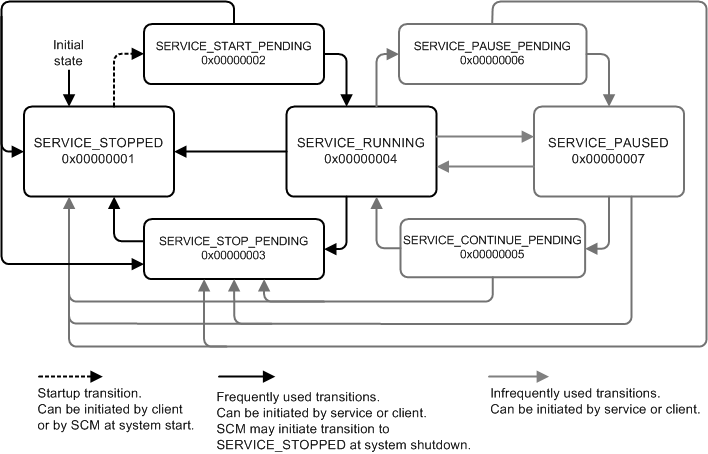
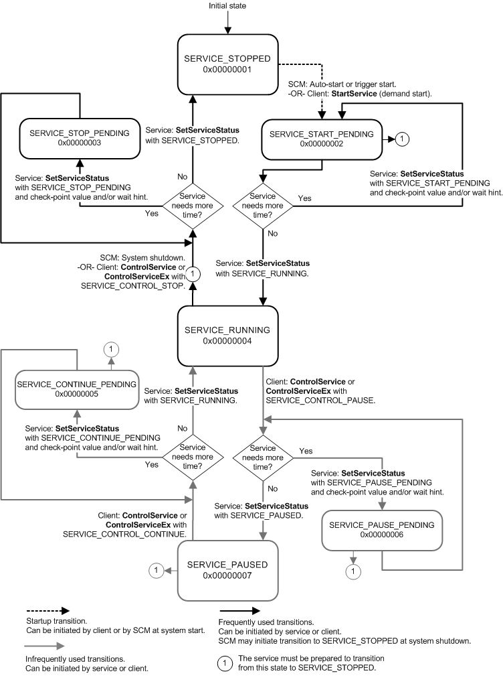

# Service State Transitions

A service is responsible for reporting changes in its state to the service control manager (SCM). Service control programs and the system can find out the state of a service only from the SCM, so it is important that a service report its state correctly. A service reports its state by calling the [**SetServiceStatus**](/windows/desktop/api/Winsvc/nf-winsvc-setservicestatus) function with a pointer to a fully initialized [**SERVICE\_STATUS**](/windows/desktop/api/Winsvc/ns-winsvc-service_status) structure. The **dwCurrentState** member of the structure contains the service state to be reported.

The initial state of a service is SERVICE\_STOPPED. When the SCM starts the service, it sets the service state to SERVICE\_START\_PENDING and calls the service's [*ServiceMain*](/windows/win32/api/winsvc/nc-winsvc-lpservice_main_functiona) function. The service then completes its initialization using one of the techniques described in [Service ServiceMain Function](service-servicemain-function.md). After the service completes its initialization and is ready to start receiving control requests, the service calls [**SetServiceStatus**](/windows/desktop/api/Winsvc/nf-winsvc-setservicestatus) to report SERVICE\_RUNNING and specify the control requests the service is prepared to accept. The transition from SERVICE\_START\_PENDING to SERVICE\_RUNNING indicates to the SCM and service-monitoring tools that the service has started successfully. If the service reports a state other than SERVICE\_RUNNING, the SCM or service-monitoring tools might mark the service as having failed to start.

The SCM sends only the specified control requests to the service (except for the SERVICE\_CONTROL\_INTERROGATE request, which is always sent). For a list of the control requests that a service can accept, see the **dwControlsAccepted** member of the [**SERVICE\_STATUS**](/windows/desktop/api/Winsvc/ns-winsvc-service_status) structure. For information about registering to receive device events, see the [**RegisterDeviceNotification**](/windows/desktop/api/winuser/nf-winuser-registerdevicenotificationa) function.

The service state typically changes as a result of handling a control request. Control requests that cause the service state to change include SERVICE\_CONTROL\_STOP, SERVICE\_CONTROL\_PAUSE, and SERVICE\_CONTROL\_CONTINUE. If the service must do lengthy processing to handle any of these requests, it should create a secondary thread to perform the lengthy processing and report the corresponding pending state to the SCM. (For best performance on Windows Vista and later versions of Windows, the service should use a worker thread from a [thread pool](/windows/desktop/ProcThread/thread-pools) for this purpose.) The service should then report the completed state transition when the lengthy processing is finished. For more information about handling control requests, see [Service Control Handler Function](service-control-handler-function.md).

Only certain service state transitions are valid. The following diagram shows the valid transitions.

The service state reported to the SCM determines how the SCM interacts with the service. For example, if a service reports SERVICE\_STOP\_PENDING, the SCM does not transmit further control requests to the service because this state indicates that the service is shutting down. The next state reported by the service should be SERVICE\_STOPPED because that is the only valid state after SERVICE\_STOP\_PENDING. However, if a service reports a transition that is not valid, the SCM does not fail the call.

The following diagram shows service state transitions in more detail, including the control requests initiated by a service control program (the service client) and the [**SetServiceStatus**](/windows/desktop/api/Winsvc/nf-winsvc-setservicestatus) calls that a service makes to report state changes to the SCM. As mentioned earlier, the SCM sends only control requests that the service has specified it will accept, so a service might not receive all of the requests shown in the diagram.

## Related topics

<dl> <dt>

[**ControlService**](/windows/desktop/api/Winsvc/nf-winsvc-controlservice)
</dt> <dt>

[**ControlServiceEx**](/windows/desktop/api/Winsvc/nf-winsvc-controlserviceexa)
</dt> <dt>

[**SetServiceStatus**](/windows/desktop/api/Winsvc/nf-winsvc-setservicestatus)
</dt> </dl>

 

 
