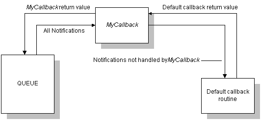

# Creating a Custom Queue Callback Routine

In addition to using the default queue callback, you can write a custom callback routine. This function must have the same form as [*FileCallback*](/windows/win32/api/setupapi/nc-setupapi-psp_file_callback_a). This is useful if you need a callback routine to handle a notification in a manner other than that provided by the default queue callback routine.

If only a small portion of the default queue callback routine's behavior needs to be changed, you can create a custom callback routine to filter the notifications, handling only those that require special behavior and calling [**SetupDefaultQueueCallback**](/windows/desktop/api/Setupapi/nf-setupapi-setupdefaultqueuecallbacka) for the others.

For example, if you wanted to custom-handle file delete errors, you could create a custom callback function, *MyCallback*. This function would intercept and process [**SPFILENOTIFY\_DELETEERROR**](spfilenotify-deleteerror.md) notifications, and call the default queue callback function for all other notifications. *MyCallback* returns a value for the delete error notifications. For all other notifications, *MyCallback* passes whatever value the default queue callback routine returned to the queue.

This flow of control is illustrated in the following diagram.

> [!IMPORTANT]
> If the custom callback function calls the default queue callback routine, it must pass the void pointer returned by [**SetupInitDefaultQueueCallback**](/windows/desktop/api/Setupapi/nf-setupapi-setupinitdefaultqueuecallback) or [**SetupInitDefaultQueueCallbackEx**](/windows/desktop/api/Setupapi/nf-setupapi-setupinitdefaultqueuecallbackex) to the default callback routine.

 

 

 
