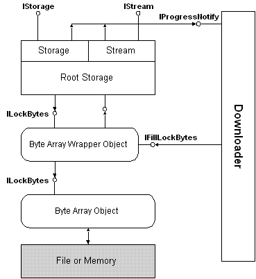

# Asynchronous Compound Files

Asynchronous Compound Files, the system-provided implementation of asynchronous storage, enables the efficient downloading of compound files from the Internet in general and the Web in particular. The basic architecture of Asynchronous Compound Files is shown in the following diagram.

The Asynchronous Compound Files implementation can work with new asynchronous moniker types that understand Internet protocols and can bind to an object identified by a URL. Such a moniker would return an asynchronous [**IStream**](/windows/desktop/api/Objidl/nn-objidl-istream) or [**IStorage**](/windows/desktop/api/Objidl/nn-objidl-istorage) pointer from the client's call to [**IMoniker::BindToStorage**](/windows/win32/api/objidl/nf-objidl-imoniker-bindtostorage).

Compound Files in general are implemented on top of a byte array object, an abstraction of a file that represents an object's data as a flat byte array. The byte array object exposes its functionality through the [**ILockBytes**](/windows/desktop/api/Objidl/nn-objidl-ilockbytes) interface. If a byte array supports nonblocking asynchronous storage, it returns E\_PENDING to the compound-file implementation, which in turn propagates the error back to the caller.

To keep track of the data available during a download, a byte array that supports asynchronous storage exposes the [**IFillLockBytes**](/windows/desktop/api/Objidl/nn-objidl-ifilllockbytes) interface on a wrapper object provided by the system specifically for this purpose. The downloading code provided by an asynchronous moniker calls this interface to fill the byte array asynchronously, as data is available. The wrapper object also exposes an **ILockBytes** interface, which the Asynchronous Compound Files implementation uses to read and write data from and to the array.

Asynchronous storage and stream objects provide a connection point for the [**IProgressNotify**](/windows/win32/api/objidl/nn-objidl-iprogressnotify) interface, which is implemented by the asynchronous moniker's downloading code. The Asynchronous Compound Files implementation calls **IProgressNotify** to provide the downloader with information about the status of the downloading operation.

 

 