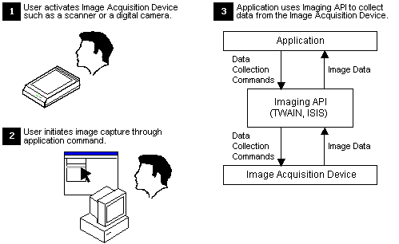
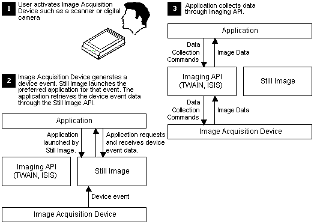

# Data Acquisition Models

Applications typically control still-image acquisition devices through imaging APIs such as TWAIN or ISIS. For the most part, applications that use these APIs operate under the pull model of data acquisition. In the pull model, you locate and select a source of data. The application then uses the imaging API to acquire data from the device. In effect, the application pulls data from the device toward itself. The following figure illustrates the pull model of data acquisition.

Microsoft Still Image API supports the use of both the pull model and the push model of data acquisition. Using the push model, still image devices notify applications of their status. You then use the standard TWAIN or ISIS APIs to acquire data. The following figure shows the push model of data acquisition.

The advantage of the push model of data acquisition is that it significantly simplifies the user model. The user model is the manner in which the user interacts with the image capture system. Under the push model of image capture, you only need to activate the image capture device to initiate image capture. When the device is activated, it generates a push model event. This in turn causes the appropriate application to be launched, and, depending on the application, image capture to be initiated. If it is already running, you just need to select **Rescan** from the application's menu system to acquire more images.

This simplified user model enables developers to create hardware and software combinations that operate much more intuitively. For example, a kiosk for creating security badges has a very intuitive user model under the push model of data acquisition. You only need to step up to the kiosk and press a button on the digital camera or kiosk to take a picture for the badge. The kiosk's digital camera generates a device event. The device event in turn launches an application to acquire the data and produce the badge. The only action that you need take in the process is to press a button. Under the pull model of data acquisition, you would have had to interact with a graphical user interface (GUI).

 

 

