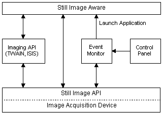

# Still Image Architecture

Developing applications that use STI does not require a comprehensive knowledge of its inner workings. However, an overview of the STI architecture aids in understanding the use of the API. A major design goal of this architecture is to reduce the software investment an application developer must make to support image acquisition devices. It is intended to allow application developers to focus on application features, rather than hardware controls.

The STI architecture has several components:

-   [Applications that Use Still Image](applications-that-use-still-image.md)
-   [Imaging APIs](imaging-apis.md)
-   [Still Image Run-Time Components](still-image-run-time-components.md)
-   [Still Image API](still-image-api.md)

> [!Note]  
> STI takes advantage of color management systems, such as Microsoft Image Color Management (ICM) 2.0, if they are present. However, since color management systems are not part of the STI architecture, they are not shown in the figure.

 

The following figure illustrates the STI architecture. The imaging application calls the Still Image API directly, through an event monitor, or through an imaging API.

 

 

