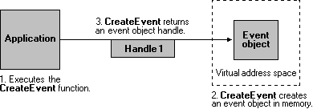
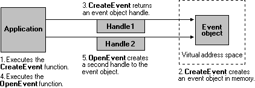
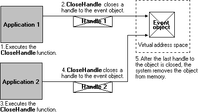
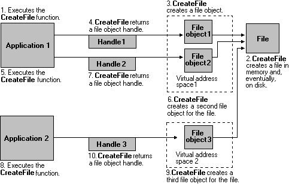
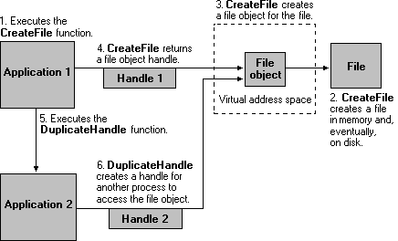

# Kernel Objects

Kernel object handles are process specific. That is, a process must either create the object or open an existing object to obtain a kernel object handle. The per-process limit on kernel handles is 2^24. However, handles are stored in the paged pool, so the actual number of handles you can create is based on available memory. The number of handles that you can create on 32-bit Windows is significantly lower than 2^24.

Any process can create a new handle to an existing kernel object (even one created by another process), provided that the process knows the name of the object and has security access to the object. Kernel object handles include access rights that indicate the actions that can be granted or denied to a process. An application specifies access rights when it creates an object or obtains an existing object handle. Each type of kernel object supports its own set of access rights. For example, event handles can have set or wait access (or both), file handles can have read or write access (or both), and so on. For more information, see [Securable Objects](/windows/desktop/SecAuthZ/securable-objects).

In the following illustration, an application creates an event object. The [**CreateEvent**](/windows/desktop/api/synchapi/nf-synchapi-createeventa) function creates the event object and returns an object handle.

After the event object has been created, the application can use the event handle to set or wait on the event. The handle remains valid until the application closes the handle or terminates.

Most kernel objects support multiple handles to a single object. For example, the application in the preceding illustration could obtain additional event object handles by using the [**OpenEvent**](/windows/desktop/api/synchapi/nf-synchapi-openeventa) function, as shown in the following illustration.

This method enables an application to have handles with different access rights. For example, Handle 1 might have set and wait access to the event, and Handle 2 might have only wait access.

If another process knows the event name and has security access to the object, it can create its own event object handle by using [**OpenEvent**](/windows/desktop/api/synchapi/nf-synchapi-openeventa). The creating application could also duplicate one of its handles into the same process or into another process by using the [**DuplicateHandle**](/windows/win32/api/handleapi/nf-handleapi-duplicatehandle) function.

An object remains in memory as long as at least one object handle exists. In the following illustration, the applications use the [**CloseHandle**](/windows/win32/api/handleapi/nf-handleapi-closehandle) function to close their event object handles. When there are no event handles, the system removes the object from memory, as shown in the following illustration.

The system manages file objects somewhat differently from other kernel objects. File objects contain the file pointer — the pointer to the next byte to be read or written in a file. Whenever an application creates a new file handle, the system creates a new file object. Therefore, more than one file object can refer to a single file on disk, as shown in the next illustration.

Only through duplication or inheritance can more than one file handle refer to the same file object, as shown in the following illustration.

The following table lists each of the kernel objects, along with each object's creator and destroyer functions. The creator functions either create the object and an object handle or create a new existing object handle. The destroyer functions close the object handle. When an application closes the last handle to a kernel object, the system removes the object from memory.

| Kernel object                | Creator function                                                                                                                                                                                                                                                  | Destroyer function                                                                      |
|------------------------------|-------------------------------------------------------------------------------------------------------------------------------------------------------------------------------------------------------------------------------------------------------------------|-----------------------------------------------------------------------------------------|
| Access token                 | [**CreateRestrictedToken**](/windows/desktop/api/securitybaseapi/nf-securitybaseapi-createrestrictedtoken), [**DuplicateToken**](/windows/desktop/api/securitybaseapi/nf-securitybaseapi-duplicatetoken), [**DuplicateTokenEx**](/windows/desktop/api/securitybaseapi/nf-securitybaseapi-duplicatetokenex), [**OpenProcessToken**](/windows/desktop/api/processthreadsapi/nf-processthreadsapi-openprocesstoken), [**OpenThreadToken**](/windows/desktop/api/processthreadsapi/nf-processthreadsapi-openthreadtoken) | [**CloseHandle**](/windows/win32/api/handleapi/nf-handleapi-closehandle)                                                      |
| Change notification          | [**FindFirstChangeNotification**](/windows/desktop/api/fileapi/nf-fileapi-findfirstchangenotificationa)                                                                                                                                                                                                 | [**FindCloseChangeNotification**](/windows/desktop/api/fileapi/nf-fileapi-findclosechangenotification)                       |
| Communications device        | [**CreateFile**](/windows/desktop/api/fileapi/nf-fileapi-createfilea)                                                                                                                                                                                                                                   | [**CloseHandle**](/windows/win32/api/handleapi/nf-handleapi-closehandle)                                                      |
| Console input                | [**CreateFile**](/windows/desktop/api/fileapi/nf-fileapi-createfilea), with CONIN$                                                                                                                                                                                                                      | [**CloseHandle**](/windows/win32/api/handleapi/nf-handleapi-closehandle)                                                      |
| Console screen buffer        | [**CreateFile**](/windows/desktop/api/fileapi/nf-fileapi-createfilea), with CONOUT$                                                                                                                                                                                                                     | [**CloseHandle**](/windows/win32/api/handleapi/nf-handleapi-closehandle)                                                      |
| Desktop                      | [**GetThreadDesktop**](/windows/desktop/api/winuser/nf-winuser-getthreaddesktop)                                                                                                                                                                                                                     | Applications cannot delete this object.                                                 |
| Event                        | [**CreateEvent**](/windows/desktop/api/synchapi/nf-synchapi-createeventa), [**CreateEventEx**](/windows/desktop/api/synchapi/nf-synchapi-createeventexa), [**OpenEvent**](/windows/desktop/api/synchapi/nf-synchapi-openeventa)                                                                                                                                                     | [**CloseHandle**](/windows/win32/api/handleapi/nf-handleapi-closehandle)                                                      |
| Event log                    | [**OpenEventLog**](/windows/desktop/api/winbase/nf-winbase-openeventloga), [**RegisterEventSource**](/windows/desktop/api/winbase/nf-winbase-registereventsourcea), [**OpenBackupEventLog**](/windows/desktop/api/winbase/nf-winbase-openbackupeventloga)                                                                                                                     | [**CloseEventLog**](/windows/desktop/api/winbase/nf-winbase-closeeventlog)                                                 |
| File                         | [**CreateFile**](/windows/desktop/api/fileapi/nf-fileapi-createfilea)                                                                                                                                                                                                                                 | [**CloseHandle**](/windows/win32/api/handleapi/nf-handleapi-closehandle), [**DeleteFile**](/windows/desktop/api/fileapi/nf-fileapi-deletefilea)                     |
| File mapping                 | [**CreateFileMapping**](/windows/desktop/api/winbase/nf-winbase-createfilemappinga), [**OpenFileMapping**](/windows/desktop/api/winbase/nf-winbase-openfilemappinga)                                                                                                                                                                          | [**CloseHandle**](/windows/win32/api/handleapi/nf-handleapi-closehandle)                                                      |
| Find file                    | [**FindFirstFile**](/windows/desktop/api/fileapi/nf-fileapi-findfirstfilea)                                                                                                                                                                                                                             | [**FindClose**](/windows/desktop/api/fileapi/nf-fileapi-findclose)                                                           |
| Heap                         | [**HeapCreate**](/windows/desktop/api/heapapi/nf-heapapi-heapcreate)                                                                                                                                                                                                                                 | [**HeapDestroy**](/windows/desktop/api/heapapi/nf-heapapi-heapdestroy)                                                     |
| I/O completion port          | [**CreateIoCompletionPort**](/windows/desktop/FileIO/createiocompletionport)                                                                                                                                                                                                           | [**CloseHandle**](/windows/win32/api/handleapi/nf-handleapi-closehandle)                                                      |
| Job                          | [**CreateJobObject**](/windows/desktop/api/winbase/nf-winbase-createjobobjecta)                                                                                                                                                                                                                       | [**CloseHandle**](/windows/win32/api/handleapi/nf-handleapi-closehandle)                                                      |
| Mailslot                     | [**CreateMailslot**](/windows/desktop/api/winbase/nf-winbase-createmailslota)                                                                                                                                                                                                                         | [**CloseHandle**](/windows/win32/api/handleapi/nf-handleapi-closehandle)                                                      |
| Memory resource notification | [**CreateMemoryResourceNotification**](/windows/desktop/api/memoryapi/nf-memoryapi-creatememoryresourcenotification)                                                                                                                                                                                     | [**CloseHandle**](/windows/win32/api/handleapi/nf-handleapi-closehandle)                                                      |
| Module                       | [**LoadLibrary**](/windows/desktop/api/libloaderapi/nf-libloaderapi-loadlibrarya), [**GetModuleHandle**](/windows/desktop/api/libloaderapi/nf-libloaderapi-getmodulehandlea)                                                                                                                                                                                  | [**FreeLibrary**](/windows/desktop/api/libloaderapi/nf-libloaderapi-freelibrary)                                                     |
| Mutex                        | [**CreateMutex**](/windows/desktop/api/synchapi/nf-synchapi-createmutexa), [**CreateMutexEx**](/windows/desktop/api/synchapi/nf-synchapi-createmutexexa), [**OpenMutex**](/windows/win32/api/synchapi/nf-synchapi-openmutexw)                                                                                                                                                     | [**CloseHandle**](/windows/win32/api/handleapi/nf-handleapi-closehandle)                                                      |
| Pipe                         | [**CreateNamedPipe**](/windows/desktop/api/winbase/nf-winbase-createnamedpipea), [**CreatePipe**](/windows/desktop/api/namedpipeapi/nf-namedpipeapi-createpipe)                                                                                                                                                                                    | [**CloseHandle**](/windows/win32/api/handleapi/nf-handleapi-closehandle), [**DisconnectNamedPipe**](/windows/desktop/api/namedpipeapi/nf-namedpipeapi-disconnectnamedpipe) |
| Process                      | [**CreateProcess**](/windows/desktop/api/processthreadsapi/nf-processthreadsapi-createprocessa), [**OpenProcess**](/windows/desktop/api/processthreadsapi/nf-processthreadsapi-openprocess), [**GetCurrentProcess**](/windows/desktop/api/processthreadsapi/nf-processthreadsapi-getcurrentprocess)                                                                                                                                     | [**CloseHandle**](/windows/win32/api/handleapi/nf-handleapi-closehandle), [**TerminateProcess**](/windows/desktop/api/processthreadsapi/nf-processthreadsapi-terminateprocess)       |
| Semaphore                    | [**CreateSemaphore**](/windows/desktop/api/winbase/nf-winbase-createsemaphorea), [**CreateSemaphoreEx**](/windows/desktop/api/winbase/nf-winbase-createsemaphoreexa), [**OpenSemaphore**](/windows/win32/api/synchapi/nf-synchapi-opensemaphorew)                                                                                                                             | [**CloseHandle**](/windows/win32/api/handleapi/nf-handleapi-closehandle)                                                      |
| Socket                       | [**socket**](/windows/desktop/api/winsock2/nf-winsock2-socket), [**accept**](/windows/desktop/api/winsock2/nf-winsock2-accept)                                                                                                                                                                                                    | [**closesocket**](/windows/desktop/api/winsock/nf-winsock-closesocket)                                                |
| Thread                       | [**CreateThread**](/windows/desktop/api/processthreadsapi/nf-processthreadsapi-createthread), [**CreateRemoteThread**](/windows/desktop/api/processthreadsapi/nf-processthreadsapi-createremotethread), [**GetCurrentThread**](/windows/desktop/api/processthreadsapi/nf-processthreadsapi-getcurrentthread)                                                                                                                           | [**CloseHandle**](/windows/win32/api/handleapi/nf-handleapi-closehandle), [**TerminateThread**](/windows/desktop/api/processthreadsapi/nf-processthreadsapi-terminatethread)         |
| Timer                        | [**CreateWaitableTimer**](/windows/win32/api/synchapi/nf-synchapi-createwaitabletimerw), [**CreateWaitableTimerEx**](/windows/win32/api/synchapi/nf-synchapi-createwaitabletimerexw), [**OpenWaitableTimer**](/windows/win32/api/synchapi/nf-synchapi-openwaitabletimerw)                                                                                                     | [**CloseHandle**](/windows/win32/api/handleapi/nf-handleapi-closehandle)                                                      |
| Update resource              | [**BeginUpdateResource**](/windows/win32/api/winbase/nf-winbase-beginupdateresourcea)                                                                                                                                                                                                         | [**EndUpdateResource**](/windows/win32/api/winbase/nf-winbase-endupdateresourcea)                                   |
| Window station               | [**GetProcessWindowStation**](/windows/desktop/api/winuser/nf-winuser-getprocesswindowstation)                                                                                                                                                                                                       | Applications cannot delete this object.                                                 |

 

## Related topics

<dl> <dt>

[Kernel Object Namespaces](/windows/desktop/TermServ/kernel-object-namespaces)
</dt> </dl>

 

 
