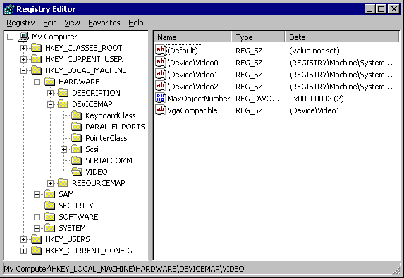

# Structure of the Registry

The registry is a hierarchical database that contains data that is critical for the operation of Windows and the applications and services that run on Windows. The data is structured in a tree format. Each node in the tree is called a *key*. Each key can contain both *subkeys* and data entries called *values*. Sometimes, the presence of a key is all the data that an application requires; other times, an application opens a key and uses the values associated with the key. A key can have any number of values, and the values can be in any form. For more information, see [Registry Value Types](registry-value-types.md) and [Registry Element Size Limits](registry-element-size-limits.md).

Each key has a name consisting of one or more printable characters. Key names are not case sensitive. Key names cannot include the backslash character (\), but any other printable character can be used. Value names and data can include the backslash character.

The name of each subkey is unique with respect to the key that is immediately above it in the hierarchy. Key names are not localized into other languages, although values may be.

The following illustration is an example registry key structure as displayed by the Registry Editor.

Each of the trees under **My Computer** is a key. The **HKEY\_LOCAL\_MACHINE** key has the following subkeys: **HARDWARE**, **SAM**, **SECURITY**, **SOFTWARE**, and **SYSTEM**. Each of these keys in turn has subkeys. For example, the **HARDWARE** key has the subkeys **DESCRIPTION**, **DEVICEMAP**, and **RESOURCEMAP**; the **DEVICEMAP** key has several subkeys including **VIDEO**.

Each value consists of a value name and its associated data, if any. **MaxObjectNumber** and **VgaCompatible** are values that contain data under the **VIDEO** subkey.

A registry tree can be 512 levels deep. You can create up to 32 levels at a time through a single registry API call.

## Related topics

<dl> <dt>

[Overview of the Windows Registry](/previous-versions/windows/it-pro/windows-server-2003/cc781906(v=ws.10))
</dt> </dl>

 

 
