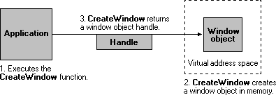

# User Objects

User interface objects support only one handle per object. Processes cannot inherit or duplicate handles to user objects. Processes in one session cannot reference a user handle in another session.

There is a theoretical limit of 65,536 user handles per session. However, the maximum number of user handles that can be opened per session is usually lower, since it is affected by available memory. There is also a default per-process limit of user handles. To change this limit, set the following registry value:

**HKEY\_LOCAL\_MACHINE**\\**SOFTWARE**\\**Microsoft**\\**Windows NT**\\**CurrentVersion**\\**Windows**\\**USERProcessHandleQuota**

This value can be set to a number between 200 and 18,000.

## Handles to User Objects

Handles to user objects are public to all processes. That is, any process can use the user object handle, provided that the process has security access to the object.

In the following illustration, an application creates a window object. The [**CreateWindow**](https://msdn.microsoft.com/library/ms632679(v=VS.85).aspx) function creates the window object and returns an object handle.

After the window object has been created, the application can use the window handle to display or change the window. The handle remains valid until the window object is destroyed.

In the next illustration, the application destroys the window object. The [**DestroyWindow**](https://msdn.microsoft.com/library/ms632682(v=VS.85).aspx) function removes the window object from memory, which invalidates the window handle.

## Managing User Objects

The following table lists the user objects, along with each object's creator and destroyer functions. The creator functions either create the object and an object handle or simply return the existing object handle. The destroyer functions remove the object from memory, which invalidates the object handle.

| User object       | Creator function                                                                                                                                                                                                                                                              | Destroyer function                                                                                   |
|-------------------|-------------------------------------------------------------------------------------------------------------------------------------------------------------------------------------------------------------------------------------------------------------------------------|------------------------------------------------------------------------------------------------------|
| Accelerator table | [**CreateAcceleratorTable**](https://msdn.microsoft.com/library/ms646365(v=VS.85).aspx)                                                                                                                                                                                                               | [**DestroyAcceleratorTable**](https://msdn.microsoft.com/library/ms646368(v=VS.85).aspx)                                    |
| Caret             | [**CreateCaret**](https://msdn.microsoft.com/library/ms648399(v=VS.85).aspx)                                                                                                                                                                                                                                     | [**DestroyCaret**](https://msdn.microsoft.com/library/ms648400(v=VS.85).aspx)                                                          |
| Cursor            | [**CreateCursor**](https://msdn.microsoft.com/library/ms648385(v=VS.85).aspx), [**LoadCursor**](https://msdn.microsoft.com/library/ms648391(v=VS.85).aspx), [**LoadImage**](https://msdn.microsoft.com/library/ms648045(v=VS.85).aspx)                                                                                                                                                   | [**DestroyCursor**](https://msdn.microsoft.com/library/ms648386(v=VS.85).aspx)                                                        |
| DDE conversation  | [**DdeConnect**](https://msdn.microsoft.com/library/ms648745(v=VS.85).aspx), [**DdeConnectList**](https://msdn.microsoft.com/library/ms648746(v=VS.85).aspx)                                                                                                                                                                                      | [**DdeDisconnect**](https://msdn.microsoft.com/library/ms648749(v=VS.85).aspx), [**DdeDisconnectList**](https://msdn.microsoft.com/library/ms648750(v=VS.85).aspx) |
| Hook              | [**SetWindowsHookEx**](https://msdn.microsoft.com/library/ms644990(v=VS.85).aspx)                                                                                                                                                                                                                           | [**UnhookWindowsHookEx**](https://msdn.microsoft.com/library/ms644993(v=VS.85).aspx)                                            |
| Icon              | [**CreateIconIndirect**](https://msdn.microsoft.com/library/ms648062(v=VS.85).aspx), [**LoadIcon**](https://msdn.microsoft.com/library/ms648072(v=VS.85).aspx), [**LoadImage**](https://msdn.microsoft.com/library/ms648045(v=VS.85).aspx)                                                                                                                                           | [**DestroyIcon**](https://msdn.microsoft.com/library/ms648063(v=VS.85).aspx)                                                            |
| Menu              | [**CreateMenu**](https://msdn.microsoft.com/library/ms647624(v=VS.85).aspx), [**CreatePopupMenu**](https://msdn.microsoft.com/library/ms647626(v=VS.85).aspx), [**LoadMenu**](https://msdn.microsoft.com/library/ms647990(v=VS.85).aspx), [**LoadMenuIndirect**](https://msdn.microsoft.com/library/ms647991(v=VS.85).aspx)                                                                                          | [**DestroyMenu**](https://msdn.microsoft.com/library/ms647631(v=VS.85).aspx)                                                            |
| Window            | [**CreateWindow**](https://msdn.microsoft.com/library/ms632679(v=VS.85).aspx), [**CreateWindowEx**](https://msdn.microsoft.com/library/ms632680(v=VS.85).aspx), [**CreateDialogParam**](https://msdn.microsoft.com/library/ms645445(v=VS.85).aspx), [**CreateDialogIndirectParam**](https://msdn.microsoft.com/library/ms645441(v=VS.85).aspx), [**CreateMDIWindow**](https://msdn.microsoft.com/library/ms644923(v=VS.85).aspx) | [**DestroyWindow**](https://msdn.microsoft.com/library/ms632682(v=VS.85).aspx)                                                        |
| Window position   | [**BeginDeferWindowPos**](https://msdn.microsoft.com/library/ms632672(v=VS.85).aspx)                                                                                                                                                                                                                     | [**EndDeferWindowPos**](https://msdn.microsoft.com/library/ms633440(v=VS.85).aspx)                                                |

 

 

 

