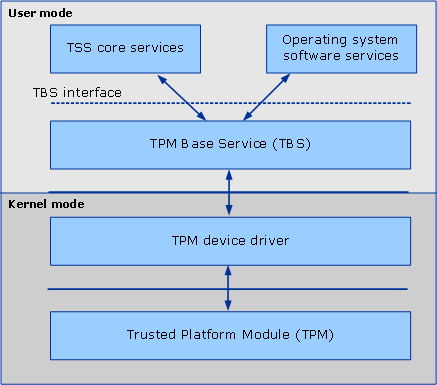

# About TBS

The TPM Base Services (TBS) feature is a system service that allows transparent sharing of the Trusted Platform Module (TPM) resources. It simultaneously shares the TPM resources among multiple applications on the same physical machine, even if those applications run on different virtual machines. Starting with Windows 8 and Windows Server 2012, TBS comes pre-installed on all systems with a TPM.

The Trusted Computing Group (TCG) defines a Trusted Platform Module that provides cryptographic functions designed to provide trust in the platform. Because the TPM is implemented in hardware, it has finite resources. The TCG also defines a software stack that makes use of these resources to provide trusted operations for application software. However, no provision is made for running a TSS implementation side-by-side with operating system software that may also be using TPM resources. The TBS feature solves this problem by enabling each software stack that communicates with TBS to use TPM resources checking for any other software stacks that may be running on the machine.

The TPM specification and TCG Software Stack (TSS) specification are available at [https://www.trustedcomputinggroup.org](https://www.trustedcomputinggroup.org/).

TBS is implemented as an out-of-process service that accepts commands that use an RPC service. A dynamically linked library presents the C language interface and communicates with the TBS service.

> [!Note]  
> The TBS service only accepts RPC requests from the local machine.

 

The primary goals of the TBS are to:

-   Provide efficient sharing of limited TPM resources, such as key slots, authorization sessions slots, and transport slots.
-   Provide prioritized and synchronized access to TPM resources between multiple instances of TPM software stacks.
-   Provide appropriate management of TPM resources across power states.
-   Prevent TPM software stacks from accessing TPM commands that should be restricted, either because of platform limitations or administrative requirements.

The following illustration shows the relationship of the TBS to the TPM.

 

 

