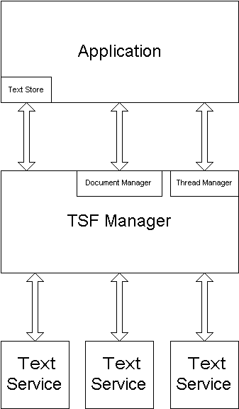

# Architecture (Text Services Framework)

Text Services Framework includes three primary components:

-   **Applications:** Application operations typically include display, direct editing, and storage of text. An application provides access to text by implementing a COM server that supports certain interfaces and communicates with TSF using interfaces that the TSF manager exposes. Throughout this documentation, the term, application, refers to a TSF-enabled application, unless otherwise specified.
-   **Text Services:** A text service functions as a text provider to an application. A text service can obtain text from, and write text to, an application. A text service can also associate data and properties with a block of text. A text service is implemented as a COM in-proc server that registers itself with TSF. When registered, the user interacts with the text service using the language bar or keyboard shortcuts. Multiple text services can be installed.
-   **TSF Manager:** The TSF manager functions as a mediator between an application and one or more text services. A text service never interacts directly with an application. All communication passes through the TSF manager. The TSF manager is implemented by the operating system and cannot be replaced. Throughout this documentation, the term, manager, refers to the TSF manager, unless otherwise specified.

The following illustration shows the primary architectural elements of TSF.

With this architecture, the TSF manager provides an abstraction layer between applications and text services. This abstraction layer enables an application and one or more text services to share text, and it enables the TSF manager to manage text services.

 

 

