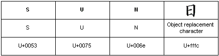

# Embedded Objects (Text Services Framework)

Text Services Framework enables a text service to embed objects in an application text stream. Embedded objects are inserted into the text stream using the value [TS\_CHAR\_EMBEDDED](ts-char--constants.md). This value resolves to the Unicode object replacement character U+fffc, using hexadecimal notation. For example, the following illustration shows the rendering of an embedded object that represents the Japanese ideograph *hi*, in combination with the sequence of Unicode characters that represent the English translation of "Sun."

The top row of the figure contains the translated text, consisting of the word "Sun" followed by the Japanese character for sun, *hi*. The center row of the figure shows the Unicode character. In the case of U+fffc, this is the object replacement character. The bottom row of the figure shows the hexadecimal value of each character.

## Supporting Embedded Objects in an Application

The TSF manager inserts an embedded object into the text stream by calling [ITextStoreACP::InsertEmbedded](/windows/desktop/api/textstor/nf-textstor-itextstoreacp-insertembedded) for an ACP-based application, or [ITextStoreAnchor::InsertEmbedded](/windows/desktop/api/Textstor/nf-textstor-itextstoreanchor-insertembedded) for an anchor-based application. When an embedded object is inserted, the application should place the **TS\_CHAR\_EMBEDDED** value at the character position (or anchor location) where the object is embedded and store the IDataObject associated with the embedded object. When [ITextStoreACP::GetText](/windows/desktop/api/textstor/nf-textstor-itextstoreacp-gettext) or [ITextStoreAnchor::GetText](/windows/desktop/api/Textstor/nf-textstor-itextstoreanchor-gettext) is called and an embedded object is contained within the text obtained, the **TS\_CHAR\_EMBEDDED** value indicates the presence and location of the embedded object. To obtain the embedded object, call [ITextStoreACP::GetEmbedded](/windows/desktop/api/textstor/nf-textstor-itextstoreacp-getembedded) with the character position of the embedded object, or [ITextStoreAnchor::GetEmbedded](/windows/desktop/api/Textstor/nf-textstor-itextstoreanchor-getembedded) with the anchor location of the embedded object.

The application does not normally recognize the embedded object contents. The application can attempt to obtain display information from the object itself. If the embedded object can supply data in a format that the application recognizes, such as CF\_UNICODETEXT or CF\_BITMAP, the application can display graphic information supplied by the object.

## Inserting Embedded Objects

A text service inserts an embedded object into a context by calling [ITfRange::InsertEmbedded](/windows/desktop/api/msctf/nf-msctf-itfrange-insertembedded) or [ITfInsertAtSelection::InsertEmbeddedAtSelection](/windows/desktop/api/msctf/nf-msctf-itfinsertatselection-insertembeddedatselection). The text service must supply the embedded IDataObject.

 

 
