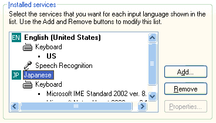

# How To Set Up Text Services Framework

To set up Text Services Framework (TSF) to be used from the desktop, you must install text services. The following procedures describe how to install text services and the TSF language control bar on Windows XP.

## How to install text services

1.  From the Control Panel, open **Regional and Language Options**.
2.  On the **Languages** tab, click **Details**.
3.  On the **Settings** tab of the **Text Services and Input Languages** window, click **Add**. Select the desired text service from the list that appears. The selected text service will appear in the following window under its associated language.

    

    To remove a text service, select it from the list in this window and click **Remove**.

    If the language bar is visible, you can quickly add, or remove, a text service as follows. Right-click the language bar and choose **Settings** , or click the **Options** button on the right end of the language bar and choose **Settings**. Then add or remove a text service as described in step 3.

## How to show the language bar

The language bar is an on-screen control with which the user can configure a text service. For the language bar to appear, one or more text services must be installed.

1.  From the Control Panel, open **Regional and Language Options**.
2.  On the **Languages** tab, click **Details**.
3.  In the **Text Services and Input Languages** window, click **Language Bar**.
4.  Select the **Show the Language bar on the desktop** check box. If necessary, first clear the **Turn off advanced text services** check box.
5.  Click **OK**.
6.  On the **Settings** tab, click **Apply**, then **OK**.
7.  Click **OK** to exit Control Panel. A floating language bar will appear.

> [!Note]
>
> For more information about how to move, hide, show, and modify the language bar, and how to remove or install a text service, click the **Help** button on the language bar, and in the drop-down menu choose **Language Bar Help**. If the Help button is not visible, add it to the language bar by clicking the **Options** button on the right end of the language bar, and in the drop-down menu choose **Help** .

 

To confirm that TSF is installed and running properly, press CRTL+ALT+DELETE, and click **Task Manager**. On the **Processes** tab, the ctfmon.exe process should be running.

## Related topics

<dl> <dt>

[Language Bar (Text Services)](language-bar.md)
</dt> <dt>

[Language Bar (Applications)](language-bar-app.md)
</dt> </dl>

 

 

