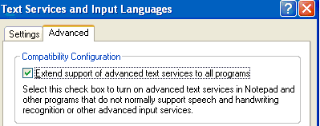

# New Features in TSF

With the release of Microsoft WindowsXP Service Pack1, Text Services Framework (TSF) has several new features.

## Extended Support of Advanced Text Services

Support has been added to TSF and Windows to provide a consistent user interface for all applications across the desktop. This new support enables legacy applications or controls that are not aware of TSF to take advantage of some advanced text services for free. For example, speech dictation and handwriting can now be used to enter text into a document in any application.

This new feature is available only for WindowsXP Service Pack1 or later. It is turned off by default. To enable it, click the check box in the new **Advanced** tab in the **Text Services and Input Languages** portion of the **Regional and Language Options** control panel.

## Rich Edit Support

[Microsoft® Rich Edit](../controls/rich-edit-controls.md) Version 4.1, used by applications to view and edit text with special character and paragraph formatting, now exposes TSF functionality. By default this support is turned off. To enable TSF in Rich Edit, a hosting application sends a special window message to the Rich Edit control.

## Security Improvements

The security and robustness of TSF have been substantially improved, to reduce the likelihood of a hostile program being able to access the stack, heap, or other secure memory locations. The security of software development kit (SDK) sample applications and text services has also been improved.

 

 