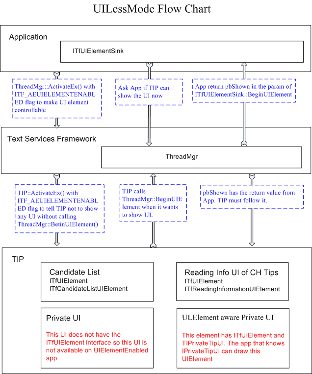
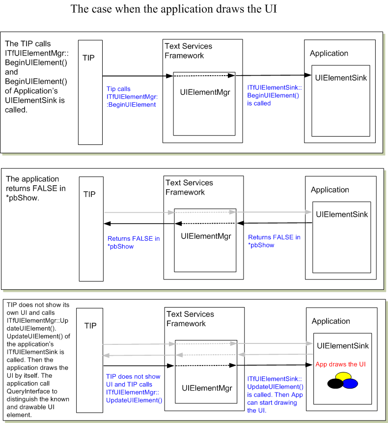
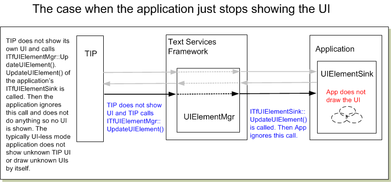
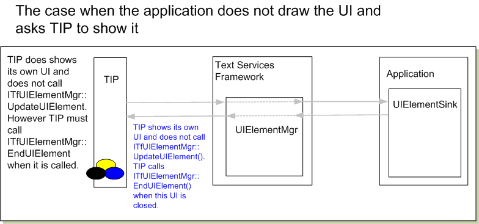

# UILess Mode Overview

## How to create UILessMode

**Making UI-less Thread:** The application can make a UI Less Thread by [**ITfThreadMgrEx::ActivateEx**](/windows/desktop/api/Msctf/nf-msctf-itfthreadmgrex-activateex) with ITF\_AE\_UIELEMENTENABLEDONLY. When ThreadMgr is activated with this flag, only TIPs that can control its UI element are activated on the thread. The application needs to implement [**ITfUIElementSink**](/windows/desktop/api/Msctf/nn-msctf-itfuielementsink) interface and advise the interface into thread manager. [**ITfUIElementSink::BeginUIElement**](/windows/desktop/api/Msctf/nf-msctf-itfuielementsink-beginuielement) is called when TIP shows its UI. The application can return **TRUE** in pbShow param to allow TIP to show TIP's original UI when the application does not want to draw. If the application does not allow TIP's UI, it can return **FALSE** in pbShow (see diagrams below). The application can draw the UI by itself by getting some information from the *pElement* param. It could be the candidate list, the language bar item, or the custom UI of TIP. The application can know the kind of UI by QIing [**ITfUIElement**](/windows/desktop/api/Msctf/nn-msctf-itfuielement) interface. When the UI is changed, [**ITfUIElementSink::UpdateUIElement**](/windows/desktop/api/Msctf/nf-msctf-itfuielementsink-updateuielement) is called. The application can compare the GUID from pElement->GetGUID() to know if the element is currently drawn by the application.

**Making UI-less Aware TIP:** TIP should support UI less mode if it wants to run under the application that does not want to allow TIP's UI such as game application or full screen applications. To be UI less aware, TIP needs to implement [**ITfTextInputProcessorEx**](/windows/desktop/api/Msctf/nn-msctf-itftextinputprocessorex) interface. If this interface is not implemented, TIP will not be activated under the UI less mode thread. In addition, TIP must call [**ITFUIElementMgr::BeginUIElement**](/windows/desktop/api/Msctf/nf-msctf-itfuielementmgr-beginuielement) before it shows a visible UI to the screen. This method makes a call to [**ITfUIElementSink**](/windows/desktop/api/Msctf/nn-msctf-itfuielementsink) to notify the application. And the application will decide if it can be shown or not. When TIP calls BeginUIElement(), TIP needs to have the [**ITfUIElement**](/windows/desktop/api/Msctf/nn-msctf-itfuielement) interface for the corresponding UI. The application will QI the interface to get another UI specific interface to retrieve more information to draw the UI. System predefines [**ITfCandidateListUIElement**](/windows/desktop/api/Msctf/nn-msctf-itfcandidatelistuielement) and [**ITfReadingInformationUIElement**](/windows/desktop/api/Msctf/nn-msctf-itfreadinginformationuielement) for TIP. When TIP wants to show the candidate list under UI less mode thread, TIP must create an instance of the **ITfCandidateListUIElement** interface and call **ITFUIElementMgr::BeginUIElement**. When [**ITfTextInputProcessorEx::ActivateEx**](/windows/desktop/api/Msctf/nf-msctf-itftextinputprocessorex-activateex) is called, TIP already know the thread is UI less more so it can eliminate the extra custom UI. However, of course, it can implement its own interface that can be QIed from and try to make a notification. Thus TIP and the appli**ITfUIElement**cation can have a negotiation for the TIP custom UI.

## UIElement Supporting TIP

The TIP that supports the UIElement must be categorized by GUID\_TFCAT\_TIPCAP\_UIELEMENTENABLED. The TIP in GUID\_TFCAT\_TIPCAP\_UIELEMENTENABLED must use [**ITfUIElementMgr**](/windows/desktop/api/Msctf/nn-msctf-itfuielementmgr) to show any UI so the application can control the visibility of the UI.

**Show/Hide status of UIElement:** Show/Hide status that is indicated by [**ITfUIElement::Show**](/windows/desktop/api/Msctf/nf-msctf-itfuielement-show) or [**ITfUIElement::IsShown**](/windows/desktop/api/Msctf/nf-msctf-itfuielement-isshown) method is the actual visible status. It is not related to the availability of UIElement. UIElement should be always available when the show status exists. The show status is controllable from the application. The application may suddenly move into UILess mode and start drawing some UI by itself, by calling **ITfUIElement::Show** with **FALSE** to hide all the UI of TIP. Then TIP can take one of some options. 1) TIP can move the UIElement to the Hide status and start generating UpdateUIElement. 2) TIP can finish UIElement since the UI element does not support Hide status and Tip calls EndUIElement() to finish it.

## Predefined UI Elements

**The candidate list:** The candidate list is one of the major UI elements for EA input. This UI Element provides the candidate list and corresponding number of the candidate strings for drawing.

**The reading information window** The reading information window is common for Chinese Keyboard Input. It has the stage that cannot be inserted into the document as the composition string. Some Chinese Input Processor opens a small reading information window that shows the reading, phonetic or typing information.

## The flow chart of UILessMode

After the TIP receives **TRUE** in \*pbShown by [**ITfUIElementMgr::BeginUIElement**](/windows/desktop/api/Msctf/nf-msctf-itfuielementmgr-beginuielement), the TIP does not have to call UpdateUIElement for the UIElement. But TIP needs to call EndUIElement() so the [**ITfUIElementMgr**](/windows/desktop/api/Msctf/nn-msctf-itfuielementmgr) and the application can track the status of UIElement. TIP must calls UpdateUIElement() after BeginUIElement() returns **FALSE** in \*pbShow. The application that wants to draw the UI does not check the contents in BeginUIElement(), it just returns the show status at BeginUIElement() and starts checking the contents at UpdateUIElement(). For example, the update flag of the candidate list UIElement has all bits at the first UpdateUIElement(). This means that the contents of UIElement does not have to be ready at BeginUIElement().

## The candidate list UIElement

**About PageIndex:** The application that draws the candidate list will calculate the number of strings per page when the contents of the list is changed (TF\_CLUIE\_STRING is set). It is not good to change the page index while the candidate list is available for UILess mode. This means that TIP's candidate list should behave the paging rather than scrolling when the selection is moved to the next page. If the scroll happens at the selection moves, the page index is changed and the application needs to recalculate the page index. The result may not be expected by TIP.

**No Selection:** [**ITfCandidateListUIElement::GetSelection**](/windows/desktop/api/Msctf/nf-msctf-itfcandidatelistuielement-getselection) returns S\_FALSE, if the candidate list does not have a selection. The return value of the first param is invalid.

 

 

