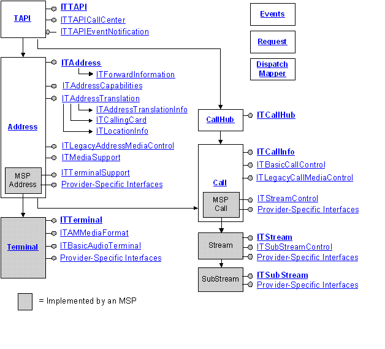

# About Call And Media Controls

TAPI 3 call and media controls are a generic set of COM objects, interfaces, and methods for making calls between two or more machines. In the context of TAPI 3, *call* refers not just to voice transmission over the public switched telephone network (PSTN) but to any medium and transport mechanism for which service providers exist: for example, a multimedia multicast conference running on a corporate intranet.

The five main objects in the TAPI 3 call and media control architecture are [TAPI](tapi-object.md), [Address](address-object.md), [Terminal](terminal-object.md), [Call](call-object.md), and [CallHub](callhub-object.md). In addition, provision has been made for [provider-specific interfaces](provider-specific-interfaces.md).

The following diagram illustrates how these objects interact.

## Features

-   Abstracts both call and media functionality to allow different and seemingly incompatible communication protocols to expose a common interface to applications.
-   Based on the Component Object Model (COM) so applications can be written in nearly any language. If you require additional information on COM, please consult the Platform Software Development Kit (SDK).
-   Call control provided by Telephony Service Providers (TSPs), which implement transport-specific mechanisms.
-   Media control provided by Media Service providers (MSPs). Current MSPs use DirectShow. DirectShow is a modular system of pluggable components called filters, arranged in a configuration called a filter graph. The filter graph manager oversees the connection of these filters and controls the stream's data flow. If you require additional information on DirectShow, please consult the Platform SDK.

 

 

