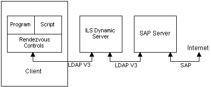

# About Rendezvous IP Telephony Conferencing

\[ Rendezvous IP Telephony Conferencing controls and interfaces are not available for use in Windows Vista, Windows Server 2008, and subsequent versions of the operating system. The RTC Client API provides similar functionality.\]

The TAPI 3 Rendezvous controls provide mechanisms to advertise and discover multiparty multimedia IP conferences. The following describes a set of Component Object Model (COM) components and interfaces to implement conferencing.

COM is the basic coding model for TAPI 3, and familiarity with it is assumed throughout this document. For information on COM, search the Platform Software Development Kit (SDK).

## Features

-   Provides the abstraction of a conference directory for manipulating announcements of multimedia conferences
-   Provides security through authentication, encryption, and a per-announcement access control layer (ACL)
-   Provides a common schema for a conference announcement, enabling searches by attribute values
-   Allows extensions through a provider-maintained attribute (conference blob) in the schema
-   Provides a COM wrapper for the multicast address allocation (MADCAP) API

## Architecture

The following descriptions and diagram illustrate key aspects of the system architecture.

-   The client can manipulate conferences stored on an ILS dynamic directory or NTDS server using Rendezvous controls. The Lightweight Directory Access Protocol (LDAP) is used to communicate with an ILS server.
-   The Rendezvous controls provide dual COM interfaces for scripting and programming.
-   A Session Announcement Protocol (SAP) server with direct access to the Internet listens to conference announcements on the Internet and populates ILS dynamic servers with the conference information. Similarly, it also announces the locally created conferences whose scope includes the Internet. (The SAP server is not planned for Microsoft Windows 2000.)

 

 

