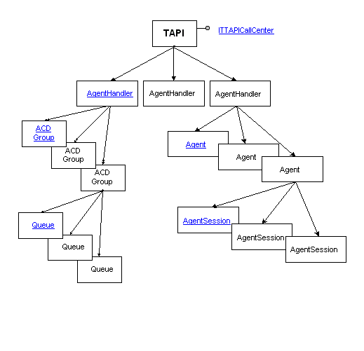

# ACD Agent Client

A call center agent is responsible for receiving and processing incoming calls and, at times, making outgoing calls to customers or prospects. An ACD Agent Client application supplies communications with the [ACD Proxy](acd-proxy.md) application, providing it with information such as whether the agent is available for calls and what types of calls the agent can handle. The following diagram illustrates how TAPI objects look to an agent.

 

 

