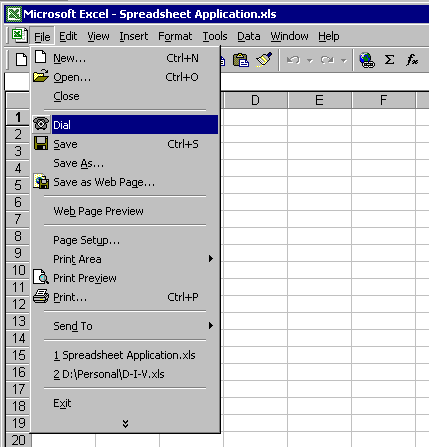

# Assisted Telephony Overview

A valuable feature of telephony is the small set of functions called Assisted Telephony. Assisted Telephony is designed to make the establishment of voice calls and of media calls available to any application, not just those dedicated to telephonic functionality. In other words, Assisted Telephony lets applications make telephone calls without needing to be aware of the details of the services of the full Telephony API. It extends telephony to word-processing applications, spreadsheets, databases, personal information managers, and other non-telephony applications.

For a list of TAPI 2.x Assisted Telephony functions of Basic Telephony, see [TAPI Quick Function Reference](./tapi-quick-function-reference.md). TAPI 3.x supports assisted telephony through the [**ITRequest**](/windows/desktop/api/tapi3if/nn-tapi3if-itrequest) interface.

The usefulness of Assisted Telephony can be illustrated by the following example. A spreadsheet application can incorporate functions that dial a telephone number for a speech call. As long as the application needs none of the detailed call control provided by the full Telephony API, Assisted Telephony is the easiest and most efficient way to give it telephonic functionality.

Assisted Telephony and the full Telephony API are used and implemented in different ways, so it is not advised to mix Assisted Telephony function calls and Telephony API function calls within a single application.

## Using Assisted Telephony

Applications that use Assisted Telephony services only initiate call requests that are temporarily queued by TAPI. The request recipient application retrieves these requests and executes them on behalf of the Assisted Telephony application. The [**tapiRequestMakeCall**](/windows/win32/api/tapi/nf-tapi-tapirequestmakecall) function requests the establishment of a voice call. The requesting application does not control the call.

TAPI allows the user to establish different or the same request recipient applications for each of these services. An application becomes a request recipient by registering with [**lineRegisterRequestRecipient**](/windows/win32/api/tapi/nf-tapi-lineregisterrequestrecipient), in which **TRUE** is specified as the value for the parameter *bEnable*. (Specifying **FALSE** deregisters the application as a request recipient, which it should do when it has determined that its recipient duties are through for the current session.) The application selects the services it wants to handle in the *dwRequestMode* parameter of **lineRegisterRequestRecipient**. A possible value for a request is LINEREQUESTMODE\_MAKECALL, to show that the application will handle [**tapiRequestMakeCall**](/windows/win32/api/tapi/nf-tapi-tapirequestmakecall) requests. If multiple applications register for the same services, a priority scheme is used to allow the user to select which application is preferred for handling requests. This priority scheme is identical to that used for call handoff and the routing of incoming calls based on a list of file names in **HandoffPriorities** in the registry.

## Call Requests

Assisted Telephony provides telephony-enabled applications with an easy-to-use mechanism for making phone calls without requiring the developer to become fully literate in telephony.

The [**tapiRequestMakeCall**](/windows/win32/api/tapi/nf-tapi-tapirequestmakecall) function requests a voice call between the user and a remote party specified by its phone number. The request is made to TAPI, which passes it to an application that is registered as a recipient of such requests. This recipient is a call manager application.

After the application has made the request, the call is controlled entirely from the call manager application because Assisted Telephony applications cannot manage calls. Because the more complex aspects of telephony and all user-interface operations are handled by the call manager application, telephony-enabled applications need not be modified in any substantial way. In fact, applications that allow this operation to be invoked from their built-in script language may not need to be modified at all.

The [**tapiGetLocationInfo**](/windows/win32/api/tapi/nf-tapi-tapigetlocationinfo) function returns to the application the country or region code and city (area) code that the user has set in the current location parameters in the Telephony Control Panel. The application can use this information to assist the user in forming proper canonical telephone numbers, such as by offering these as defaults when new numbers are entered in a phone book entry or database record.

## Request Recipients

Two kinds of applications are needed to run Assisted Telephony. Assisted Telephony *clients* are applications that use Assisted Telephony by calling the functions that have the prefix "tapi." An example of such a client application would be a spreadsheet to which a **Dial** menu command or toolbar button is added.

Assisted Telephony *servers* are applications that can execute Telephony API functions that result from another application's call to a "tapi"-prefixed function. To make itself known as an Assisted Telephony server, such an application registers as one using the [**lineRegisterRequestRecipient**](/windows/win32/api/tapi/nf-tapi-lineregisterrequestrecipient) function.

The functions of Assisted Telephony (which begin with the prefix "tapi") are known as *request functions*. Assisted Telephony applications that process these requests—Assisted Telephony servers—are called *request recipients*.

## Processing Assisted Telephony Requests

The process with which requests are delivered and serviced is as follows:

1.  When TAPI receives an Assisted Telephony request, it checks for a request recipient, that is, an application currently registered to process that type of request. If there is a request recipient, the request is queued, and the highest-priority application that has registered for that request's service is sent a [**LINE\_REQUEST**](./line-request.md) message. The message notifies the request recipient that a new request has arrived, and it carries an indication of the request's mode.
2.  If TAPI cannot find a currently running application to process such a request, it tries to launch an application that has been registered as capable of doing so. This registration information is recorded in **HandoffPriorities** in the registry. TAPI tries to launch applications in the order in which they are listed in the **HandoffPriorities** section. (See the following step.)

    If no application is currently registered, TAPI examines the list of request-processing applications on the associated entry in **HandoffPriorities**. If the associated line is missing from the file, if there are no applications listed on it, or if none of the applications in the list can be launched, the request is rejected with the error TAPIERR\_NOREQUESTRECIPIENT.

    When a request recipient is launched (whether or not it has been launched by TAPI) it is its duty to call [**lineRegisterRequestRecipient**](/windows/win32/api/tapi/nf-tapi-lineregisterrequestrecipient) during the startup process and register itself as a request recipient.

3.  If one or more applications are listed in the entry, TAPI begins with the first listed application (highest priority), and attempts to launch it using the [**CreateProcess**](/windows/desktop/api/processthreadsapi/nf-processthreadsapi-createprocessa) function. If the attempt to launch the application fails, TAPI attempts to launch the next application in the list. When any application launches successfully, TAPI simply queues the request and returns a success indication to the application even though the request hasn't yet been signaled to the request recipient.

    After the request recipient application is launched, it calls [**lineRegisterRequestRecipient**](/windows/win32/api/tapi/nf-tapi-lineregisterrequestrecipient), which causes a [**LINE\_REQUEST**](./line-request.md) message to be sent, signaling that the request is queued. If for some reason the launched application never registers, the request remains queued and remains in the queue indefinitely until an application registers for that type of request.

4.  If TAPI finds such a registered application already running or successfully launches one, it queues the request, sending a LINE\_REQUEST message to the server application, and returns a success indication for the function call to the Assisted Telephony application. This success message states only that the request has been accepted and queued, not that it has been successfully executed.

When the server application is ready to process a request, it calls the [**lineGetRequest**](/windows/win32/api/tapi/nf-tapi-linegetrequest) function. This lets it receive any information it needs, such as an address to dial. It then processes the request, using the TAPI functions (such as [**lineMakeCall**](/windows/win32/api/tapi/nf-tapi-linemakecall) and [**lineDrop**](/windows/win32/api/tapi/nf-tapi-linedrop)) that would otherwise be used to place the call. Invoking **lineGetRequest** removes the request from TAPI, and the request parameters are copied in an application-allocated request buffer. The size and interpretation of the contents of the buffer depend on the request mode.

The server must ensure that it uses the correct parameters when executing requests. When doing so, these steps are followed:

1.  The request recipient first receives a [**LINE\_REQUEST**](./line-request.md) message informing it that requests can exist for it in the request queue. This tells the application to call [**lineGetRequest**](/windows/win32/api/tapi/nf-tapi-linegetrequest) and keep calling it until the queue is drained (if the request is for making a new call), or to drop an existing call. This message does not contain the parameters for the request, except in the case of a request to drop an existing call.
2.  If the request is to make a new call, the Assisted Telephony server uses the [**lineGetRequest**](/windows/win32/api/tapi/nf-tapi-linegetrequest) function to retrieve the full request, which includes the request's parameters. The server now has all the information it needs, such as the number to dial or the identification of the maker of the request. First, however, the server must allocate the memory needed to store this information.
3.  Finally, the server executes the request by invoking the appropriate TAPI function or set of functions.

If TAPI cannot launch an application capable of serving as a request recipient, the Assisted Telephony call fails and returns the error TAPIERR\_NOREQUESTRECIPIENT.

## Notes on Request Recipient Operations

The following information concerns systems on which Assisted Telephony requests are processed:

-   The default registry should list a call manager application in the priority list for [**tapiRequestMakeCall**](/windows/win32/api/tapi/nf-tapi-tapirequestmakecall). It would be helpful, but not essential, for the call manager application to have a menu option that allows users to set it to the highest priority.
-   When an Assisted Telephony recipient application is launched automatically by TAPI and if it is the only TAPI application in the system, this action initializes TAPI. If the Assisted Telephony recipient application initializes and shuts down the line device before registering for Assisted Telephony requests, TAPI is shut down as well, and the Assisted Telephony request is lost. Assisted Telephony requests might also be lost when another TAPI application that is launched performs an initialize and shutdown.

 

 
