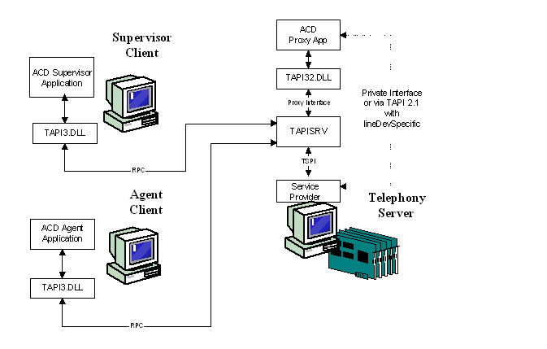

# Call Center Controls

A call center is a location with agents or operators at banks of telephones either making outgoing telephone calls or fielding incoming ones. For example, a bank or credit card company uses a call center to process account inquiries.

TAPI 3.x implements objects, interfaces, and methods that assist the programmer in creating call center applications. From a programming point of view, call center operations using TAPI are represented by the following diagram.

A programmer interested in creating call center applications may also want to consult the TAPI 2.2 functions that can enable portions of a call center suite. See TAPI 2.2 [Call Center Control](./call-center-control.md).

 

 
