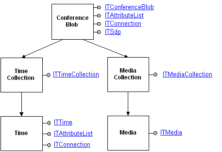

# Conference Blob Controls

\[ Rendezvous IP Telephony Conferencing controls and interfaces are not available for use in Windows Vista, Windows Server 2008, and subsequent versions of the operating system. The RTC Client API provides similar functionality.\]

The following diagram illustrates the main objects involved in TAPI 3 conference blob controls. Interfaces shown are hyperlinked into the relevant reference pages.

The conference blob contains provider-specific information on a conference object. A pointer to the [**ITConferenceBlob**](itconferenceblob.md) interface blob is obtained by doing a QueryInterface on [**ITDirectoryObjectConference**](/windows/desktop/api/Rend/nn-rend-itdirectoryobjectconference). The **ITConferenceBlob** interface provides methods for basic manipulation of a generic conference blob. An application using non-SDP conference blobs must implement its own methods for detail manipulation.

Rendezvous provides the [**ITSdp**](itsdp.md) interface for manipulating SDP conference blobs. The SDP is a protocol for describing multimedia sessions and their related scheduling information. For additional information on the SDP protocol, locate Internet Engineering Task Force (IETF) RFC 2327 entitled "SDP: Session Description Protocol." If the **ITSDP** interface exists for a given conference blob, you can obtain a pointer to it by doing a **QueryInterface** on [**ITConferenceBlob**](itconferenceblob.md).

For SDP conference blobs, the [**ITTimeCollection**](ittimecollection.md), [**ITTime**](ittime.md), [**ITMediaCollection**](itmediacollection.md), and [**ITMedia**](itmedia.md) interfaces allow detailed control of SDP conference time and media characteristics.

 

 

