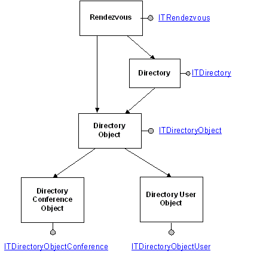

# Directory Controls

\[ Rendezvous IP Telephony Conferencing controls and interfaces are not available for use in Windows Vista, Windows Server 2008, and subsequent versions of the operating system. The RTC Client API provides similar functionality.\]

The following diagram illustrates the main objects involved in TAPI 3 Rendezvous directory controls. Interfaces shown are hyperlinked into the relevant reference pages.

The main directory control interface is [**ITRendezvous**](/windows/desktop/api/Rend/nn-rend-itrendezvous), which must be created by calling **CoCreateInstance**. The Rendezvous object exposes methods to get lists of available directories and to create new directories or directory objects.

A directory resides on a server and is a list of directory objects along with descriptive information. Methods associated with [**ITDirectory**](/windows/desktop/api/Rend/nn-rend-itdirectory) can get information associated with the directory as a whole, such as whether it is an ILS directory.

A directory object can represent a conference or a user. The [**ITDirectoryObject**](/windows/desktop/api/Rend/nn-rend-itdirectoryobject) interface supplies methods that can retrieve or modify information generic to a directory object, such as the dialable address.

Conference and user information, such as the URL of a conference or the primary IP phone of a user, is manipulated by methods provided in the [**ITDirectoryObjectConference**](/windows/desktop/api/Rend/nn-rend-itdirectoryobjectconference) and [**ITDirectoryObjectUser**](/windows/desktop/api/Rend/nn-rend-itdirectoryobjectuser) interfaces.

 

 

