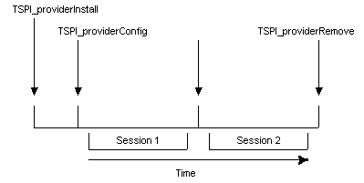

# Life Cycle of a Telephony Service Provider

This topic provides a high-level review of TSP operations.

A session is the time during which a particular configuration remains valid and telephony operations are carried out. A service provider can support many sessions between the time it is first loaded and when it is finally freed. For each session, TAPI negotiates the version of the interface, starts the session, carries out operations, and eventually shuts down the session. The service provider must not retain information from one session to the next.

After the interface version is known, TAPI calls the [**TSPI\_providerInit**](/windows/win32/api/tspi/nf-tspi-tspi_providerinit) function to set all operational parameters. The service provider is ensured that all of the configuration information in the registry is stable when the **TSPI\_providerInit** function is called. Most service providers read all configuration information at that time.

Normal operations can proceed in any order, after the service provider is initialized.

TAPI negotiates device-specific information on a per-device basis. TAPI and the service provider commit to a version when a device is opened.

The service provider can receive requests to select and cancel extension versions. While an extension version is selected, the device operates strictly according to that device-specific extension version.

Negotiation of a device-specific extension version can happen multiple times, both before and after the device is opened. TAPI passes a version range, and the service provider chooses and returns a value from this range. Normally, the service provider has device-specific extensions disabled.

This commits both TAPI and the service provider to operating at that extension version level until the selection is canceled. During the time that a device-specific extension is in effect, an attempt to negotiate an extension version level should allow only the version level that is currently in effect. After the device-specific extension is canceled, a different version can be negotiated and selected.

Phone operations within the **Open/Close** pair are shown in the following illustration. Some of these operations are synchronous, others are asynchronous. If an operation completes asynchronously, another operation can be requested before the first reports completion. Thus, operations can overlap in any way. The service provider must eventually report completion for any asynchronous operation requested. Closing a phone forces outstanding asynchronous operations to complete (possibly with a "failure" indication).

The life cycle for line devices is similar to the life cycle for phones, except that lines have their own negotiation, initialization, open, and close procedures. Operations on open lines are bracketed by their own **Open/Close** pair. This pair is in turn bracketed between the same **Initialization/Shutdown** pair as the phone **Open/Close**.

The life cycles of calls are bracketed strictly between the **Open/Close** of the line that contains them. Lifetimes of calls can begin in several ways:

-   Requested from TAPI through functions such as [**lineMakeCall**](/windows/win32/api/tapi/nf-tapi-linemakecall), [**lineSetupTransfer**](/windows/win32/api/tapi/nf-tapi-linesetuptransfer), or [**lineSetupConference**](/windows/win32/api/tapi/nf-tapi-linesetupconference).
-   Spontaneously originated in the service provider as new incoming calls, user-initiated calls on an attached telephone handset, or calls generated as a side effect of other operations such as putting an existing call on hold.

The lifetimes of distinct calls within the same line can overlap each other in any way. All calls end their lifetime at the time the TSPI function [**TSPI\_lineCloseCall**](/windows/win32/api/tspi/nf-tspi-tspi_lineclosecall) is invoked. The life cycle of several calls is shown in the following illustration.

A call can originate in TAPI as shown with the **MakeCall/CloseCall** pair. A call can also originate in the service provider. The service provider announces this with a [**LINE\_NEWCALL**](line-newcall.md) message to a TAPI-supplied callback procedure. In such a case, TAPI returns its identifier for the call, which is included in subsequent callbacks reporting events occurring on the call. In the case of calls whose lifetime originates in TAPI, this identifier is included in the TSPI operation that creates the call.

All of the operations that start the lifetime of a call result in TAPI and service provider exchanging identifiers for the new call. In the case of TAPI originated calls, TAPI passes its identifier and receives the service provider's identifier as a return parameter. In the case where the call originates in the service provider, the service provider passes its identifier to TAPI and receives the TAPI identifier as a return parameter.

The following illustration offers a very high-level view of service provider installation, configuration, and removal; life-cycle sequences that span many sessions. The typical life-cycle for these operations can be shown with the following time line.

The typical installation and removal life cycle is shown, spanning multiple sessions. Calls to the **Install** and [**Remove**](/windows/win32/api/tapi3if/nf-tapi3if-itcollection2-remove) procedures are strictly paired and do not overlap. Calls to the **Config** procedure can happen multiple times within this pair. One is typically done by the service provider as an internal side effect of the **Install** procedure to create line and phone entries. The **Config** procedure may be called at other times to alter an existing setup. The **Install** procedure must be done before any other TSPI function is permitted. In the ideal scenario, all sessions are strictly nested within the **Install/Remove** procedure pair.

The functions [**TSPI\_providerInstall**](/windows/win32/api/tspi/nf-tspi-tspi_providerinstall), [**TSPI\_providerConfig**](/windows/win32/api/tspi/nf-tspi-tspi_providerconfig), and [**TSPI\_providerRemove**](/windows/win32/api/tspi/nf-tspi-tspi_providerremove) interact with the service provider itself rather than with any specific device. They affect static configuration information that survives across multiple sessions and must be present for any other operation to proceed. Thus, all other operations are nested between the invocation of **TSPI\_providerInstall** and the completion of its matching **TSPI\_providerRemove**. These two operations typically happen very far apart, most likely in a different load of the service provider or a different boot of the machine. Calling the **Config** function externally is optional, because the **Install** procedure is required to include the **Config** behavior in addition to its own. The usual reason for calling it externally is to modify an existing configuration.

There is a subtlety embedded in the concept of the completion of a [**TSPI\_providerRemove**](/windows/win32/api/tspi/nf-tspi-tspi_providerremove) operation. It is desirable to allow the user to run the Telephony Control Panel utility supplied with the telephony service to alter service provider configurations, even when telephony operations (sessions) are in progress. Consequently, both the [**TSPI\_providerConfig**](/windows/win32/api/tspi/nf-tspi-tspi_providerconfig) and **TSPI\_providerRemove** specifications allow for invocation while there is an outstanding session. However, any changes to the configuration are required to be delayed until telephony operations are shut down and restarted. Thus, strictly speaking, the completion of any **TSPI\_providerConfig** or **TSPI\_providerRemove** operation happens outside any session. The nesting of actions is as shown in the figure, even though the procedures calls may appear in a slightly different order. It is permitted for a service provider to simply disallow **Config** or [**Remove**](/windows/win32/api/tapi3if/nf-tapi3if-itcollection2-remove) while operations are in progress, although the user should be notified with a dialog box. A more user-friendly implementation that allows at least a subset of operations is preferred.

These **Install**, **Config**, and [**Remove**](/windows/win32/api/tapi3if/nf-tapi3if-itcollection2-remove) operations all have the side effect of signaling any running telephony applications, which eventually results in them shutting down their use of the telephony service. Together, this ends all outstanding sessions for service providers. This signifies to service providers that they must read the new registry configuration when new sessions begin. Any changes that were pending due to a **Config** or [**Remove**](/windows/win32/api/tapi3if/nf-tapi3if-itcollection2-remove) while operations were in progress then take effect.

 

 
