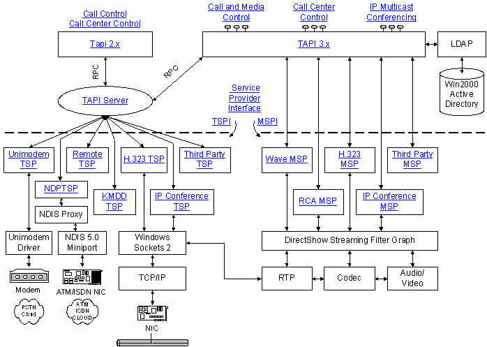

# Microsoft Telephony Overview

Telephony integrates computers with communications devices and networks. Under classic telephony, the device was a telephone and the network was the Public Switched Telephone Network (PSTN). Modern telephony continually expands the range of devices and networks, and currently covers devices such as cameras and networks such as the Internet.

Possible telephony applications include:

-   Multicast multimedia IP conferencing
-   Voice calls over the Internet (VoIP)
-   Automatic Call Distribution (ACD) Center client and server applications
-   Basic voice calls on the PSTN
-   PBX-like controls such as call park and selective forwarding on a corporate phone network without the need to invest in specialized hardware
-   Interactive voice response (IVR) systems
-   Real-time collaboration

The following diagram illustrates Microsoft Telephony architecture, and is hyperlinked as a basic roadmap to the material in the TAPI documentation. Please note that TAPI is not limited to PSTN, ISDN, or TCP/IP transport.

 

 

