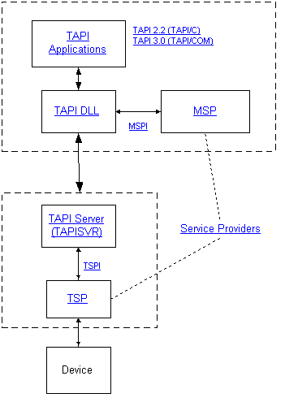

# Microsoft Telephony Programming Model

The Microsoft Telephony programming model abstracts communications control from device control, freeing end-user applications and device manufacturers from the need to march in lockstep. Using this model, an end-user or server application does not require detailed information on device control and the device does not need to be tailored to the application. Applications and devices can undergo innovation and change without rendering each other useless to customers.

The following diagram illustrates how this abstraction is accomplished.

These components can be viewed as repositories of specialized knowledge. The Telephony Application Programming Interface (TAPI) application knows user needs, the TAPI DLL and TAPISRV understand general telephony, and the service providers (TSP and MSP) know detailed device control. Application writers and device manufacturers require only general knowledge of each other's requirements.

-   An application loads the TAPI DLL into its process space and uses TAPI to communicate needs.
-   TAPI establishes an RPC link communications with the TAPI Server.
-   In addition, TAPI 3.x creates an MSP object and communicates with it using a defined set of commands, the Media Service Provider Interface (MSPI).
-   When an application calls a TAPI operation, the TAPI dynamic-link library validates and marshals the parameters, then forwards the information to TAPISRV.
-   TAPISRV tracks communications resources available to the local machine and interfaces with the Telephony Service Providers (TSPs) using the Telephony Service Provider Interface (TSPI).
-   Communications between a TSP and an MSP take place using a virtual connection that passes through the TAPI DLL and TAPISRV.
-   The TSP/MSP pair supplies information on device state and capabilities and implements the specific commands required for a desired response.

The result of using this programming model is that applications can ignore or adjust to device changes and new devices can be instantly useful instead of waiting on code base changes. Potential market share is expanded for both application writers and device manufacturers.

The following topics describe the Microsoft Telephony components in more detail:

-   [TAPI Applications](tapi-applications.md)
-   [TAPI DLL](tapi-dll.md)
-   [TAPI Server](tapi-server.md)
-   [Service Providers](service-providers.md)
-   [Synchronous/Asynchronous Model](synchronous-asynchronous-model.md)
-   [TAPI Data Structures](tapi-data-structures.md)
-   [TAPI Levels of Service](tapi-levels-of-service.md)

 

 

