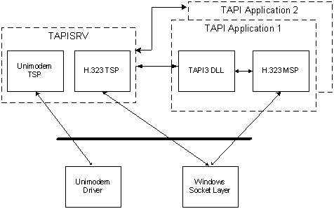

# MSP Architecture

In TAPI architecture, all TSPs are run in the context of TAPISRV, which is implemented as a service process within SVCHOST. TAPI applications live in their own process. TAPI applications load Tapi3.dll and any needed MSPs into their own process, and the TAPI DLL communicates with TAPISRV through a private RPC interface. The following diagram illustrates the interaction of these components.



A media service provider (MSP) provides media streaming using the abstractions of Terminals, Streams, and SubStreams.

A Terminal is a sink or source for a media stream. It may be a physical object, such as a speaker or a microphone, or it may be an abstraction of a device, such as a video window. The [Terminal Object](terminal-object.md) exposes the [**ITTerminal**](/windows/win32/api/tapi3if/nn-tapi3if-itterminal) interface. The class of terminal is described by the [**Terminal Class**](terminal-class.md) GUID. An MSP may define its own terminal classes.

Streams divide the media of a call based on the [**media type**](tapimediatype--constants.md) or type, the stream's [**direction**](/windows/desktop/api/Tapi3if/ne-tapi3if-terminal_direction), and the destination address of the media. For example, an incoming audio stream from a modem is a stream object, an outgoing video stream to an IP address and port is a stream object, the video streams coming from a IP multicast group are also considered as one stream object. The Stream object is represented by the [**ITStreamControl**](/windows/win32/api/tapi3if/nn-tapi3if-itstreamcontrol) interface.

SubStreams allow finer control over the media. For example, in the IP multicast case, the incoming video stream object might represent several people. The application will most likely want each participant to have a separate renderer. The incoming video stream can be divided into several substreams, one for each person. One substream would correspond to one person, and can be configured and controlled separately. The SubStream object is represented by the [**ITSubStreamControl**](/windows/win32/api/tapi3if/nn-tapi3if-itsubstreamcontrol) interface.

When an application calls [**ITAddress::CreateCall**](/windows/desktop/api/tapi3if/nf-tapi3if-itaddress-createcall) to set up a call, it must specify the type of media required. On an outgoing call, it simply tells TAPI when the call is created. For example:

``` syntax
HRESULT hr = pAddress->CreateCall( 
       pszDestAddress, 
       lAddressType, 
       TAPIMEDIATYPE_AUDIO | TAPIMEDIATYPE_VIDEO, 
       &pCall 
       ); 
// If (hr != S_OK ) process the error here
```

In this case, the application is creating an outgoing audio-video call.

The media types passed in indicate the media that the application is interested in over the lifetime of the call. For example, the application may specify audio and video when creating the call, but select only audio terminals at the beginning. The MSP will start streaming only audio, but will not reject a local or remote video request made later in the lifetime of the call.

When the application then calls [**ITBasicCallControl::Connect**](/windows/desktop/api/tapi3if/nf-tapi3if-itbasiccallcontrol-connect), TAPI 3 calls [**TSPI\_lineMakeCall**](/windows/win32/api/tspi/nf-tspi-tspi_linemakecall) in the TSP. After a call is established, the MSP and TSP can communicate as necessary.

When a call is disconnecting, it is up to the MSP and TSP to communicate about tearing down the call. Tapi3.dll will call [**TSPI\_lineDrop**](/windows/win32/api/tspi/nf-tspi-tspi_linedrop) if the application calls [**Disconnect**](/windows/desktop/api/tapi3if/nf-tapi3if-itbasiccallcontrol-disconnect).

 

 
