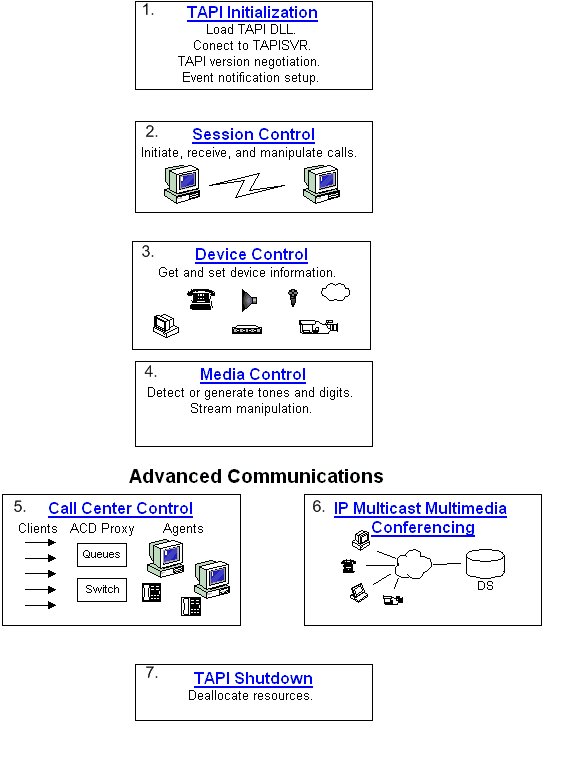

# TAPI Applications

The following material provides guidelines on using TAPI to write end-user or server communications applications. This information is also highly relevant to service provider programmers.

The first decision a programmer needs to make in using TAPI is the level of service required. For example, if an application requires a menu selection that can dial a phone number, a full TAPI application is probably not required. Assisted Telephony can enable this option quickly and simply. Please see [TAPI Levels of Service](tapi-levels-of-service.md) for more information on the distinction between full TAPI applications and Assisted Telephony.

The second important decision is whether to use TAPI 2.x, the C-based API, or TAPI 3.x, which is based on COM. Please see [TAPI 3.x vs. TAPI 2.x](tapi-3-x-versus-tapi-2-x.md) for a discussion of important considerations in deciding which one to use.

The following diagram illustrates the basic building blocks of a full TAPI application. TAPI 2.x and TAPI 3.x are both addressed in these sections. Material that is highly specific to one is addressed in the overview sections for TAPI 2.x or TAPI 3.x.

The following links provide content that corresponds to the figures in the above image:

| Figure | Documentation                                                                    |
|--------|----------------------------------------------------------------------------------|
| 1      | [TAPI Initialization](tapi-initialization.md)                                   |
| 2      | [Session Control](session-control.md)                                           |
| 3      | [Device Control](device-control.md)                                             |
| 4      | [Media Control](media-control.md)                                               |
| 5      | [About Call Center Controls](about-call-center-controls.md)                     |
| 6      | [Rendezvous IP Telephony Conferencing](rendezvous-ip-telephony-conferencing.md) |
| 7      | [TAPI Shutdown](tapi-shutdown.md)                                               |

 

 

 

