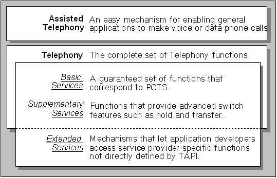

# TAPI Levels of Service

TAPI telephony services are divided into Assisted Telephony services and the services provided by the full Telephony API. In general, the full Telephony API is used to implement powerful telephonic applications, and Assisted Telephony is used to add minimal but useful telephonic functionality to non-telephony applications. Telephony's services are divided into the groups shown in the following illustration:

 

 

