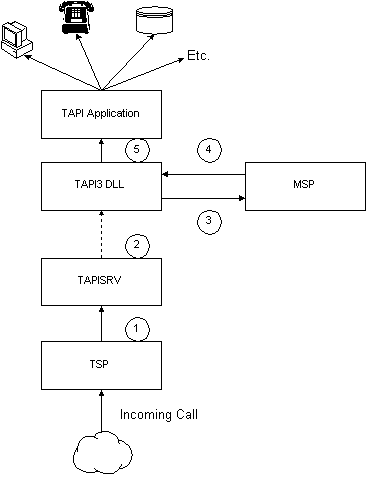

# TAPI Service Provider Overview

TAPI applications reside in their own process space. TAPI applications load the Tapi32.dll or Tapi3.dll into their process, and TAPI communicates with TAPISRV through a private RPC interface. A TSP runs in the context of TAPISRV. A given TSP may reside on a machine other than the user's machine and is accessed using a remote TSP. TAPISRV is implemented as a service process within SVCHOST. An MSP lives within the process space of the application and is always local.

A TSP/MSP pair can be regarded as having a virtual private communication path. Information can be sent between the two using opaque buffers that are not interpreted by either TAPISRV or the TAPI DLL.

Some service providers implement operations specific to the hardware involved. TAPI 2.x provides access to such operations through the [**lineDevSpecific**](/windows/win32/api/tapi/nf-tapi-linedevspecific) or [**phoneDevSpecific**](/windows/win32/api/tapi/nf-tapi-phonedevspecific) function. TAPI 3.x exposes [provider-specific Interfaces](./provider-specific-interfaces.md).

The following diagram illustrates the flow of controls and information, showing one stand-alone TSP (Unimodem) and one TSP/MSP pair (H.323).

The following diagram illustrates the progress of an incoming call that involves both a TSP and an MSP.

## Incoming Call Setup

-   The TSP sends a [**LINE\_NEWCALL**](line-newcall.md) message to TAPISRV. The [**call state**](./linecallstate--constants.md) is LINECALLSTATE\_OFFERING.
-   TAPISRV notifies clients of the call.
-   TAPI3 creates the TAPI Call object, then calls [**ITMSPAddress::CreateMSPCall**](/windows/win32/api/tapi3/nf-tapi3-itmspaddress-createmspcall), which is implemented by the MSP.
-   The MSP creates an MSP Call object and default streams based on the [**media types**](./tapimediatype--constants.md) required for the call. It returns an IUnknown pointer to the MSP call object.
-   TAPI3 aggregates the MSP Call object into the TAPI Call object, making interfaces such as [**ITStreamControl**](/windows/win32/api/tapi3if/nn-tapi3if-itstreamcontrol) available to the application. It then notifies the application of the new call.

The application may then use methods such as [**ITStream::SelectTerminal**](/windows/win32/api/tapi3if/nf-tapi3if-itstream-selectterminal) to complete preparations for call completion.

## Incoming Call Completion

-   The application calls [**ITBasicCallControl::Answer**](/windows/win32/api/tapi3if/nf-tapi3if-itbasiccallcontrol-answer).
-   TAPI3 calls [**lineAnswer**](/windows/win32/api/tapi/nf-tapi-lineanswer).
-   TAPISERV calls [**TSPI\_lineAnswer**](/windows/win32/api/tspi/nf-tspi-tspi_lineanswer).
-   The TSP initiates call streaming. Usually, the TSP sends a message to the corresponding MSP, and the MSP starts the streams. In some TSP/MSP implementations, the TSP starts the streams.

## TSP/MSP Communication During Call Progress

After the call is in progress, the TSP and the MSP communicate by passing opaque buffers through TAPISRV and TAPI3.

-   The TSP sends information to the MSP by sending the [**LINE\_SENDMSPDATA**](line-sendmspdata.md) message to TAPISRV.
-   The MSP receives information from the TSP through the [**ITMSPAddress::ReceiveTSPData**](/windows/win32/api/tapi3/nf-tapi3-itmspaddress-receivetspdata) method. If the data is related to a MSP call object, an interface pointer to the MSP call object is provided as a parameter of that method.
-   The MSP sends information to the TSP by sending a MSP\_TSP\_DATA event to TAPI 3.
-   The TSP receives information from the MSP through the [**TSPI\_lineReceiveMSPData**](/windows/win32/api/tspi/nf-tspi-tspi_linereceivemspdata) function.

The exact process and content of communication between service providers is specific to a given TSP/MSP set.

> [!Note]  
> For outgoing calls, the MSP typically knows about the call before the TSP. If the MSP tries to communicate with the TSP before the TSP is informed about a call, the communication will fail. When the MSP and the TSP need to exchange information concerning a specific call, the TSP should initiate communication.

 

 

 
