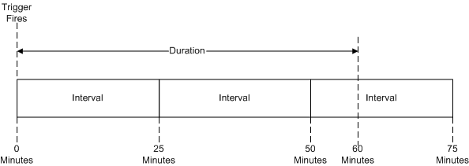

# Repeating A Task

Task Scheduler can run a task any number of times times after a trigger is fired. To do this, the trigger defines a repetition pattern that tells Task Scheduler how long it should continue to repeat the task and the time interval between each task repetition.

## Repetition Pattern

The following illustration shows a repetition pattern with a duration of 60 minutes and an interval of 25 minutes. Be aware that in this case, Task Scheduler runs the task when the trigger is fired, it runs the task again after 25 minutes, then runs the task again after 50 minutes depending on the setting of the [**StopAtDurationEnd property of IRepetitionPattern**](/windows/desktop/api/taskschd/nf-taskschd-irepetitionpattern-get_stopatdurationend) ([**RepetitionPattern.StopAtDurationEnd**](repetitionpattern-stopatdurationend.md) for scripting). If the **StopAtDurationEnd** property is set to True, Task Scheduler stops the last instance of the task if it is still running after 60 minutes. If the **StopAtDurationEnd** property is set to False, the last instance of the task is run regardless of the duration.

If you register a task that contains a trigger with a repetition interval equal to one minute and a repetition duration equal to four minutes, the task will be started five times. The five repetitions can be defined by the following pattern:

1.  A task starts at the beginning of the first minute.
2.  The next task starts at the end of the first minute.
3.  The next task starts at the end of the second minute.
4.  The next task starts at the end of the third minute.
5.  The next task starts at the end of the fourth minute.

**Windows Server 2003, Windows XP and Windows 2000:** If you register a task that contains a trigger with a repetition interval equal to one minute and a repetition duration equal to four minutes, the task will be started four times.

## Objects, Interfaces, and XML Elements

For scripting development, the repetition pattern is defined using the [**RepetitionPattern**](repetitionpattern.md) object.

For C++ development, the repetition pattern is defined by the [**IRepetitionPattern**](/windows/desktop/api/taskschd/nn-taskschd-irepetitionpattern) interface.

When reading or writing XML for a task, the repetition pattern is specified in the [**Repetition**](taskschedulerschema-repetition-triggerbasetype-element.md) element.

## Related topics

<dl> <dt>

[Task Triggers](task-triggers.md)
</dt> </dl>

 

 

