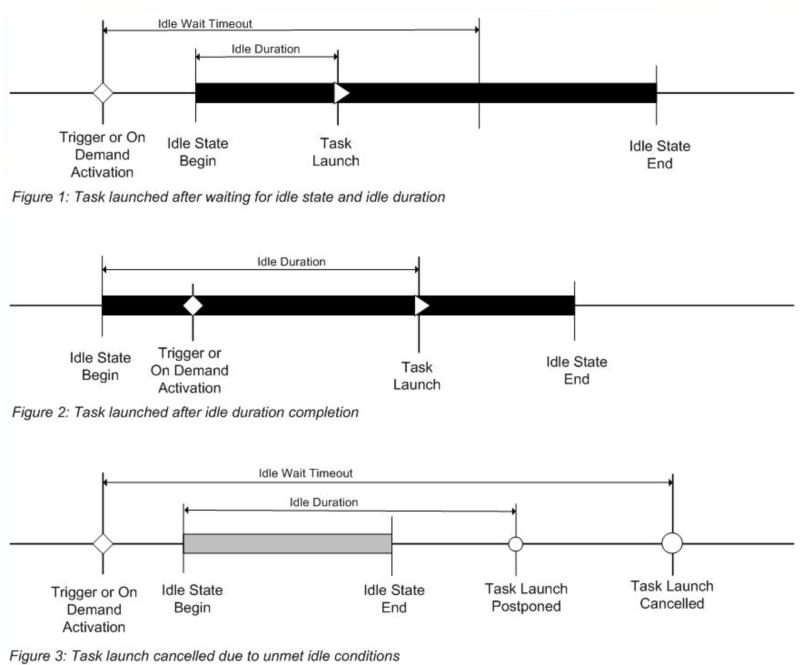

# Task idle conditions

A task can be handled in several ways when the computer enters an idle state. This includes defining an idle trigger or setting the idle conditions for when the task starts.

## Detecting the idle state

In Windows 7, the Task Scheduler verifies that the computer is in an idle state every 15 minutes. Task Scheduler checks for an idle state using two criteria: user absence, and a lack of resource consumption. The user is considered absent if there is no keyboard or mouse input during this period of time. The computer is considered idle if all the processors and all the disks were idle for more than 90% of the last detection interval. (An exception would be for any presentation type application that sets the ES\_DISPLAY\_REQUIRED flag. This flag forces Task Schedule to not consider the system as being idle, regardless of user activity or resource consumption.)

In Windows 7, Task Scheduler considers a processor as idle even when low priority threads (thread priority < normal) execute.

In Windows 7, when the Task Scheduler detects that the computer is idle, the service waits only for user input to mark the end of the idle state.

In Windows 8, Task Scheduler performs the same general user absence and resource consumption checks. However, Task Scheduler relies on the operating system power subsystem to detect user presence. By default, the user is considered absent after four minutes of no keyboard or mouse input. The resource consumption verification time is shortened to 10 minute intervals when the user is present. When the user is away, the verification time is shortened to 30 second intervals. Task Scheduler makes additional resource consumption checks for the following events:

-   User presence state changed
-   AC/DC power source changed
-   Battery level changed (only when on batteries)

When any of the events above happens, Task Scheduler tests the computer for idleness since the last verification time. In practice, this means that Task Scheduler may declare the system as idle immediately after user absence is detected, if the other conditions have been met since the last verification time.

In Windows 8, the CPU and IO thresholds are set to 80%.

When detecting the idle state in Windows 8 Server, Task Scheduler does not take user presence or absence into account. To mark the end of the idle state, Task Scheduler revises the resource consumption once in 90 minutes.

## Defining an idle trigger

A task can be started when the computer enters an idle state by defining an idle trigger.

An idle trigger will only trigger a task action if the computer enters an idle state after the start boundary of the trigger.

An application can define an idle trigger by using the [**IIdleTrigger**](/windows/win32/api/taskschd/nn-taskschd-iidletrigger) interface.

If reading or writing XML, the idle trigger is specified by the [**IdleTrigger**](taskschedulerschema-idletrigger-triggergroup-element.md) element of the Task Scheduler schema.

## Task settings for idle conditions

The task settings can be used to define how the Task Scheduler handles the task when the computer enters an idle state.

The following illustrations provide three possible timelines that show how these different idle conditions relate to each other. Be aware that the illustrations start when the task trigger is activated or when the task is started on demand (without requesting to [ignore the existing task constraints](/windows/win32/api/taskschd/ne-taskschd-task_run_flags)).

> [!NOTE]
> The *Duration* and *WaitTimeout* settings are deprecated. They're still present in the Task Scheduler user interface, and their interface methods may still return valid values, but they're no longer used.

The following list describes the idle conditions.
- Idle start: The time when the computer enters the idle state.
- Idle end: The time when the computer transitions out of the idle state. Be aware that the amount of time the computer is in the idle state is independent of the idle duration time that was described previously.

Idle wait and Idle duration have been deprecated.
- Idle wait: The amount of time that the Task Scheduler will wait for an idle state to occur after a task trigger is activated or after the task is started on demand.
- Idle duration: The amount of time you want the computer to have been idle before starting the task.

For example, if a task is set to start only if the computer is idle for 30 minutes, and the task waits for the computer to be idle for 10 minutes, then the task will launch in 5 minutes only if the computer has been idle for 25 minutes prior to the time the trigger was activated. The task will not start if the computer enters an idle state 5 minutes after the trigger is activated.

By default, a task [**DisallowStartIfOnBatteries**](/windows/desktop/api/taskschd/nf-taskschd-itasksettings-get_disallowstartifonbatteries) property is set to true, which means the Task Scheduler service will not run tasks that are triggered by an idle trigger (or a trigger with idle conditions) when a computer is running on battery power. You can change this behavior by setting the **DisallowStartIfOnBatteries** property to false.

If a task is triggered by an idle trigger, then the [**WaitTimeout**](/windows/desktop/api/taskschd/nf-taskschd-iidlesettings-get_waittimeout) property of the [**IIdleSettings**](/windows/desktop/api/taskschd/nn-taskschd-iidlesettings) interface ([**IdleSettings**](idlesettings.md) for scripting) is ignored.

Applications can control the idle conditions by setting the properties in the [**IIdleSettings**](/windows/desktop/api/taskschd/nn-taskschd-iidlesettings) and [**IIdleTrigger**](/windows/win32/api/taskschd/nn-taskschd-iidletrigger) interfaces.

If reading or writing XML, these conditions are specified in the [**Settings**](taskschedulerschema-settings-tasktype-element.md) element of the Task Scheduler schema.

## Cycling idle condition

If the computer is cycling in and out of the idle state, you can terminate and restart the task using the following idle conditions. To terminate and restart a task, both properties and elements must be set to True:

-   To terminate the task when the idle condition ends, set the [**StopOnIdleEnd**](/windows/desktop/api/taskschd/nf-taskschd-iidlesettings-get_stoponidleend) property or the [**StopOnIdleEnd**](taskschedulerschema-terminateonidleend-idlesettingstype-element.md) element to True.
-   To restart the task when the computer cycles into the idle condition again, set the [**RestartOnIdle**](/windows/desktop/api/taskschd/nf-taskschd-iidlesettings-get_restartonidle) property or the [**RestartOnIdle**](taskschedulerschema-restartonidle-idlesettingstype-element.md) element to True.
