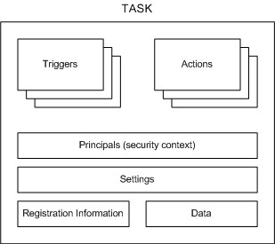

# Tasks

A task is the scheduled work that the Task Scheduler service performs. A task is composed of different components, but a task must contain a trigger that the Task Scheduler uses to start the task and an action that describes what work the Task Scheduler will perform.

When a task is created, it is stored in a task folder. Task folders can be accessed through the [**ITaskFolder**](/windows/win32/taskschd/nn-taskschd-itaskfolder?branch=master) interface ([**TaskFolder**](taskfolder.md) for scripting), and tasks can be accessed through the [**IRegisteredTask**](/windows/win32/taskschd/nn-taskschd-iregisteredtask?branch=master) interface ([**RegisteredTask**](registeredtask.md) for scripting) when they are created. You can change access control lists (ACLs) for tasks and task folders in order to grant or deny certain users and groups access to a task or task folder. This can be done by using the [**IRegisteredTask::SetSecurityDescriptor**](/windows/win32/taskschd/nf-taskschd-iregisteredtask-setsecuritydescriptor?branch=master) method, the [**ITaskFolder::SetSecurityDescriptor**](/windows/win32/taskschd/nf-taskschd-itaskfolder-setsecuritydescriptor?branch=master) method, or by specifying a security descriptor when a task is registered by using the [**RegisterTaskDefinition**](/windows/win32/taskschd/nf-taskschd-itaskfolder-registertaskdefinition?branch=master) or [**RegisterTask**](/windows/win32/taskschd/nf-taskschd-itaskfolder-registertask?branch=master) method.

> [!Note]  
> If the Local System account is denied access to a task file or task folder, then the Task Scheduler service can produce unexpected results.

 

## Components of a Task

The following illustration shows the task components.

The following list contains a brief description of each task component:

-   Triggers: Task Scheduler uses event or time-based triggers to know when to start a task. Every task can specify one or more triggers to start the task.

    For more information about triggers, see [Task Triggers](task-triggers.md).

-   Actions: These are the actions, the actual work, that is performed by the task. Every task can specify one or more actions to complete its work.

    For more information about actions, see [Task Actions](task-actions.md).

-   Principals: Principals define the security context in which the task is run. For example, a principal might define a specific user or user group that can run the task.

    For more information about principals, see [Security Contexts for Tasks](security-contexts-for-running-tasks.md).

-   Settings: These are the settings that the Task Scheduler uses to run the task with respect to conditions that are external to the task itself. For example, these settings can specify the priority of the task with respect to other tasks, whether multiple instances of the task can be run, how the task is handled when the computer is in an idle condition, and other conditions.

    For more information about task settings, see [**ITaskSettings**](/windows/win32/taskschd/nn-taskschd-itasksettings?branch=master) ([**TaskSettings**](tasksettings.md) for scripting).

    > [!Note]  
    > By default, a task will be stopped 72 hours after it starts to run. You can change this by changing the [**ExecutionTimeLimit**](/windows/win32/taskschd/nf-taskschd-itasksettings-get_executiontimelimit?branch=master) setting.

     

-   Registration Information: This is administrative information that is gathered when the task is registered. For example, this information describes the author of the task, the date when the task was registered, an XML description of the task, and other information.

    For more information about task registration information, see [Task Registration Information](task-registration-information.md).

-   Data: This is additional documentation about the task that is supplied by the author of the task. For example, this data may contain XML Help that can be used by users when they run the task.

## Task APIs

Task Scheduler 2.0 provides two sets of APIs: a set of scripting objects and interfaces for Task Scheduler 2.0. For more information, see [Task Scheduler Reference](task-scheduler-reference.md).

Task compatibility, which is set through the [**Compatibility**](/windows/win32/taskschd/nf-taskschd-itasksettings-get_compatibility?branch=master) property, should only be set to TASK\_COMPATIBILITY\_V1 if a task must be accessed or modified from a Windows XP, Windows Server 2003, or Windows 2000 computer. Otherwise, it is recommended that you use Task Scheduler 2.0 compatibility because it has more features.

Starting with Task Scheduler 2.0, the [**ITaskService**](/windows/win32/taskschd/nn-taskschd-itaskservice?branch=master) interface ([**TaskService**](taskservice.md) for scripting) is used as a starting point to create tasks in specified folders. The [**ITaskDefinition**](/windows/win32/taskschd/nn-taskschd-itaskdefinition?branch=master) interface ([**TaskDefinition**](taskdefinition.md) for scripting) is used to hold all the components of a task, such as the settings, actions, and triggers. The [**ITaskTrigger**](/windows/win32/Mstask/nn-mstask-itasktrigger?branch=master), [**IAction**](/windows/win32/taskschd/nn-taskschd-iaction?branch=master), and [**ITaskSettings**](/windows/win32/taskschd/nn-taskschd-itasksettings?branch=master) APIs provide properties that are then used to define the other components of the task. Task Scheduler 1.0 provides the [**ITask**](/windows/win32/Mstask/nn-mstask-itask?branch=master) interface, which is supported only for backward compatibility.

For scripting, the Task Scheduler interfaces map to scripting objects that have the similar names, properties, and methods. For example, the [**TaskService**](taskservice.md) scripting object has the same properties and methods as the [**ITaskService**](/windows/win32/taskschd/nn-taskschd-itaskservice?branch=master) interface.

For more information and examples about how to use the Task Scheduler interfaces, scripting objects, and XML, see [Using the Task Scheduler](using-the-task-scheduler.md).

### Task Scheduler 1.0 Tasks

A Task Scheduler 1.0 task is any application or file type that the Task Scheduler can execute. These may include any of the following (as supported by the operating system on which the task will execute): Win32 applications, Win16 applications, OS/2 applications, MS-DOS applications, batch files (\*.bat), command files (\*.cmd), or any properly registered file type.

Data that describes a task is kept in a task file that is stored in the Scheduled Tasks folder. For more information, see [*Scheduled Tasks folder*](s.md#-msb-scheduled-tasks-folder-gly). The name of these task files include the name of the task, followed by a .job file name extension.

For more information about adding Task Scheduler 1.0 tasks, see [Adding Work Items](adding-work-items.md).

For more information about enumerating through Task Scheduler 1.0 tasks, see [Enumerating Tasks](enumerating-tasks.md).

For a Windows Server 2003, Windows XP, or Windows 2000 computer to create, monitor, or control tasks on a Windows Vista computer, the following operations should be completed on the Windows Vista computer, and the user who is calling the [**ITaskScheduler::SetTargetComputer**](/windows/win32/Mstask/nf-mstask-itaskscheduler-settargetcomputer?branch=master) method must be a member of the Administrators group on the remote Windows Vista computer.

**To enable the "Share File and Printers" exception in Windows Firewall**

1.  Click **Start**, and then click **Control Panel**.
2.  In **Control Panel**, click **Classic View** and then double-click the **Windows Firewall** icon.
3.  In the **Windows Firewall** window, click the **Exceptions** tab and select **File and Printer Sharing exception** check box.

**To enable the "Remote Registry" service**

-   Open a Command Prompt window and enter the following command: **net start "Remote Registry"**.

## Related topics

<dl> <dt>

[About the Task Scheduler](about-the-task-scheduler.md)
</dt> <dt>

[Task Triggers](task-triggers.md)
</dt> <dt>

[Task Actions](task-actions.md)
</dt> <dt>

[**ITaskDefinition**](/windows/win32/taskschd/nn-taskschd-itaskdefinition?branch=master)
</dt> <dt>

[**TaskDefinition**](taskdefinition.md)
</dt> <dt>

[**ITaskService**](/windows/win32/taskschd/nn-taskschd-itaskservice?branch=master)
</dt> <dt>

[**TaskService**](taskservice.md)
</dt> </dl>

 

 

