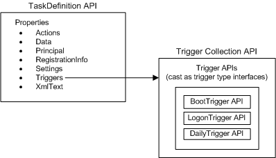
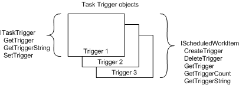

# Trigger Interfaces

The APIs that are used to manage triggers vary depending on the version of the Task Scheduler. However, in both cases these APIs enable you to create new triggers, retrieve and update existing triggers, and delete triggers that are no longer required.

Applications that are developed using Task Scheduler 2.0 can use objects and interfaces to create, retrieve, modify, and delete the triggers for a task.

In the following illustration, a task specifies a collection of triggers using its Triggers property. This collection contains one or more individual trigger APIs with each API specifying a specific trigger type. For example, in the illustration below the trigger collection contains a boot trigger, logon trigger, and a daily trigger.

### Object APIs for Scripting Development

For more information about the methods and properties of the objects that are used to specify triggers, see:

-   [**TaskDefinition**](taskdefinition.md)
-   [**TriggerCollection**](triggercollection.md)
-   [**Trigger**](trigger.md)
-   [**BootTrigger**](boottrigger.md)
-   [**DailyTrigger**](dailytrigger.md)
-   [**EventTrigger**](eventtrigger.md)
-   [**IdleTrigger**](idletrigger.md)
-   [**LogonTrigger**](logontrigger.md)
-   [**MonthlyDOWTrigger**](monthlydowtrigger.md)
-   [**MonthlyTrigger**](monthlytrigger.md)
-   [**RegistrationTrigger**](registrationtrigger.md)
-   [**TimeTrigger**](timetrigger.md)
-   [**WeeklyTrigger**](weeklytrigger.md)

### Interfaces APIs for C++ Development

For more information about the methods and properties of the interfaces that are used to specify triggers, see:

-   [**ITaskDefinition**](/windows/desktop/api/taskschd/nn-taskschd-itaskdefinition)
-   [**ITriggerCollection**](/windows/desktop/api/taskschd/nn-taskschd-itriggercollection)
-   [**ITrigger**](/windows/desktop/api/taskschd/nn-taskschd-itrigger)
-   [**IBootTrigger**](/windows/desktop/api/taskschd/nn-taskschd-iboottrigger)
-   [**IDailyTrigger**](/windows/desktop/api/taskschd/nn-taskschd-idailytrigger)
-   [**IEventTrigger**](/windows/desktop/api/taskschd/nn-taskschd-ieventtrigger)
-   [**IIdleTrigger**](/windows/win32/api/taskschd/nn-taskschd-iidletrigger)
-   [**ILogonTrigger**](/windows/desktop/api/taskschd/nn-taskschd-ilogontrigger)
-   [**IMonthlyDOWTrigger**](/windows/desktop/api/taskschd/nn-taskschd-imonthlydowtrigger)
-   [**IMonthlyTrigger**](/windows/desktop/api/taskschd/nn-taskschd-imonthlytrigger)
-   [**IRegistrationTrigger**](/windows/desktop/api/taskschd/nn-taskschd-iregistrationtrigger)
-   [**ITimeTrigger**](/windows/desktop/api/taskschd/nn-taskschd-itimetrigger)
-   [**IWeeklyTrigger**](/windows/desktop/api/taskschd/nn-taskschd-iweeklytrigger)

## Task Scheduler 1.0 Trigger Interfaces

Existing applications that are developed using Task Scheduler 1.0 can use the methods that are available from the Task Scheduler 1.0 interfaces to create, retrieve, modify, and delete the triggers for a [*work item*](w.md). However, note that all Task Scheduler 1.0 interfaces, enumerations, and structures are obsolete and should not be used for the development of new applications.

The two interfaces that are used to do this are shown in the following illustration. The [**IScheduledWorkItem**](/windows/desktop/api/Mstask/nn-mstask-ischeduledworkitem) interface is used to manage all the triggers that are associated with a work item (such management includes creating a new trigger for the work item). The [**ITaskTrigger**](/windows/desktop/api/Mstask/nn-mstask-itasktrigger) interface is used to manage a specific trigger.

The [**IScheduledWorkItem**](/windows/desktop/api/Mstask/nn-mstask-ischeduledworkitem) interface provides methods for creating a new trigger for a work item, retrieving the number of triggers that are associated with a work item, retrieving the [*trigger structures*](t.md) that are associated with the work item, retrieving [*trigger strings*](t.md) that are associated with the work item, and for deleting triggers.

Once the trigger object is available, you can use the [**ITaskTrigger**](/windows/desktop/api/Mstask/nn-mstask-itasktrigger) interface to retrieve the trigger structure and the string of the trigger and to set the criteria that is used to fire the trigger. This interface is used only when you are working with a [*task trigger object*](t.md).

## Related topics

<dl> <dt>

[Task Triggers](task-triggers.md)
</dt> <dt>

[Trigger Types](trigger-types.md)
</dt> <dt>

[Trigger Structures](trigger-structures.md)
</dt> </dl>

 

 