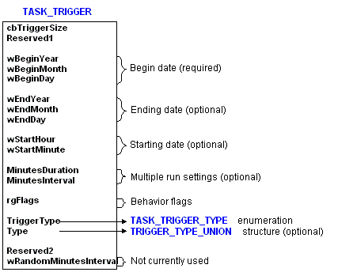
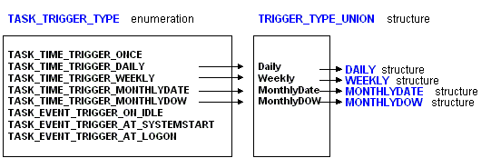

# Trigger Structures for Task Scheduler 1.0

Task Scheduler 1.0 uses several structures to define the criteria of a trigger.

> [!Note]  
> For more information about Task Scheduler 2.0 triggers, see [Trigger Interfaces](trigger-interfaces.md).

 

## Task Scheduler 1.0 Structures

The following illustration shows the [**TASK\_TRIGGER**](/windows/desktop/api/Mstask/ns-mstask-task_trigger) structure. It has three required members (**wBeginYear**, **wBeginMonth**, and **wBeginDay**) that must be set when creating a new trigger. (To jump to the reference page for this structure, click the structure name in the illustration.)

Be aware that the **TriggerType** member uses the [**TASK\_TRIGGER\_TYPE**](/windows/desktop/api/Mstask/ne-mstask-task_trigger_type) enumeration and the **Type** member uses a **TASK\_TRIGGER\_UNION** structure. The **TASK\_TRIGGER\_TYPE** enumeration is used to specify the type of trigger (event and time-based trigger types). The [**TRIGGER\_TYPE\_UNION**](/windows/desktop/api/Mstask/ns-mstask-trigger_type_union) structure is used to combine the [**DAILY**](/windows/desktop/api/Mstask/ns-mstask-daily), [**WEEKLY**](/windows/desktop/api/Mstask/ns-mstask-weekly), [**MONTHLYDATE**](/windows/desktop/api/Mstask/ns-mstask-monthlydate) (day of month), and [**MONTHLYDOW**](/windows/desktop/api/Mstask/ns-mstask-monthlydow) (day of week) structures that are used to specify when a time-based trigger will fire.

If **TriggerType** specifies a one-time time-based trigger or an event-based trigger, the **Type** member is ignored. The [**TRIGGER\_TYPE\_UNION**](/windows/desktop/api/Mstask/ns-mstask-trigger_type_union) structure is used only if the **TriggerType** member specifies a daily, weekly, day-of-month, or monthly day-of-week time-based trigger.

In addition, the setting of the **Type** member indicates which member of the [**TRIGGER\_TYPE\_UNION**](/windows/desktop/api/Mstask/ns-mstask-trigger_type_union) structure is used. The following illustration shows the relationship between the values of the [**TASK\_TRIGGER\_TYPE**](/windows/desktop/api/Mstask/ne-mstask-task_trigger_type) enumeration and the members of the **TRIGGER\_TYPE\_STRUCTURE** structure. (To jump to the reference pages for these structures click the structure name in the illustration.)

## Related topics

<dl> <dt>

[Task Triggers](task-triggers.md)
</dt> <dt>

[Trigger Types](trigger-types.md)
</dt> <dt>

[Trigger Interfaces](trigger-interfaces.md)
</dt> </dl>

 

 

