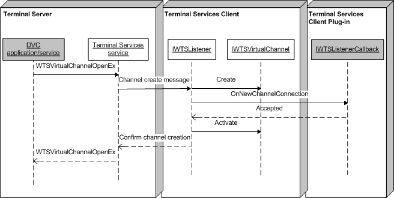

# Accepting a Connection (Remote Desktop Services)

At some point in time, the dynamic virtual channel (DVC) client will request a connection to the DVC listener. When this occurs, the listener can spawn a unique communication channel to the client, which is handled by the [**OnNewChannelConnection**](/windows/desktop/api/TsVirtualChannels/nf-tsvirtualchannels-iwtslistenercallback-onnewchannelconnection) method of [**IWTSListenerCallback**](/windows/desktop/api/TsVirtualChannels/nn-tsvirtualchannels-iwtsvirtualchannelcallback). For an example, see the implementation of **CDVCSamplePlugin::OnNewChannelConnection** in the [DVC Client Plug-in Example](dvc-client-plug-in-example.md) sample code.

The following figure shows the sequence of events for establishing a DVC connection. The shaded objects are user-supplied (DVC application/service and [**IWTSListenerCallback**](/windows/desktop/api/TsVirtualChannels/nn-tsvirtualchannels-iwtslistenercallback)), while the un-shaded objects are part of the framework (Remote Desktop Session Host (RD Session Host) service, listener, and [**IWTSVirtualChannel**](/windows/desktop/api/TsVirtualChannels/nn-tsvirtualchannels-iwtsvirtualchannel)).

> [!Note]  
> This figure assumes that a listener object has been created through a [**CreateListener**](/windows/desktop/api/TsVirtualChannels/nf-tsvirtualchannels-iwtsvirtualchannelmanager-createlistener) call to [**IWTSVirtualChannelManager**](/windows/desktop/api/TsVirtualChannels/nn-tsvirtualchannels-iwtsvirtualchannelmanager), and that the plug-in has specified [**IWTSListenerCallback**](/windows/desktop/api/TsVirtualChannels/nn-tsvirtualchannels-iwtslistenercallback) as a parameter.

 

 

 

