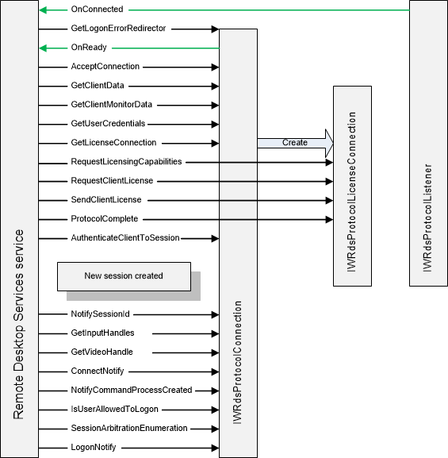

# Connection Sequence

The following illustration shows the method calls made between the Remote Desktop Services service and your protocol during the client connection sequence. The actions shown here follow the [Start Sequence](start-sequence.md). The interaction between the service and the [**IWRdsProtocolLicenseConnection**](/windows/desktop/api/wtsprotocol/nn-wtsprotocol-iwrdsprotocollicenseconnection) object represents the licensing handshake for the client.

## Related topics

<dl> <dt>

[Method Call Sequence](method-call-sequence.md)
</dt> <dt>

[Reconnect Sequence](reconnect-sequence.md)
</dt> <dt>

[Start Sequence](start-sequence.md)
</dt> </dl>

 

 

