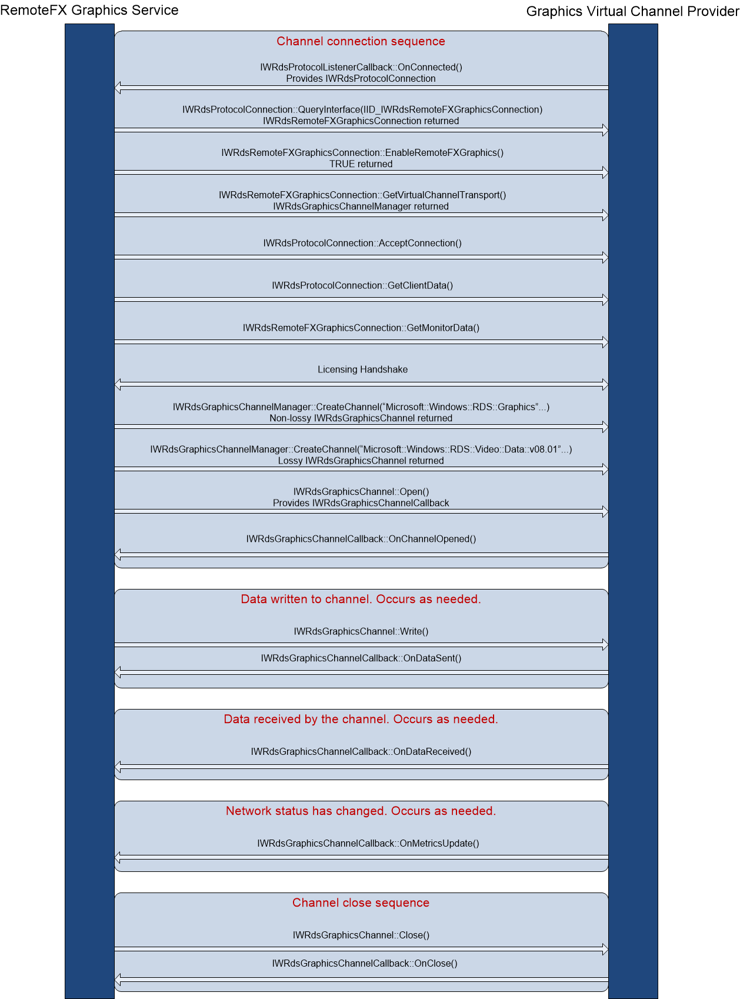

# Graphics virtual channels reference

The graphics virtual channels reference contains programming elements that enable you to create a virtual graphics channel.

The following illustration shows the interaction between the RemoteFX graphics service and the graphics virtual channel.

## In this section

<dl> <dt>

[Graphics virtual channels interfaces](graphics-virtual-channels-interfaces.md)
</dt> <dd>

The graphics virtual channels API supports the following interfaces.

</dd> <dt>

[Graphics virtual channels enumerations](graphics-virtual-channels-enumerations.md)
</dt> <dd>

The graphics virtual channels API defines the following enumerations.

</dd> </dl>

 

 

