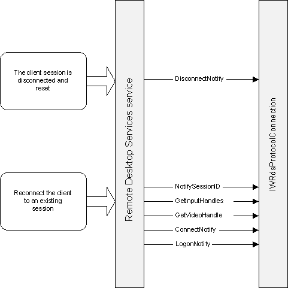

# Reconnect Sequence

The following illustration shows the method calls made between the Remote Desktop Services service and your protocol during a reconnection sequence.

## Related topics

<dl> <dt>

[Method Call Sequence](method-call-sequence.md)
</dt> <dt>

[Connection Sequence](connection-sequence.md)
</dt> <dt>

[Start Sequence](start-sequence.md)
</dt> </dl>

 

 

