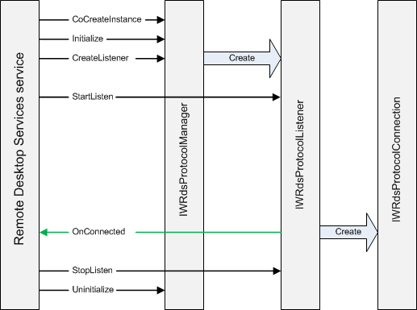

# Start Sequence

To start your protocol provider, the Remote Desktop Services service:

-   Retrieves the name of the listener and the CLSID of your protocol manager object ([**IWRdsProtocolManager**](/windows/desktop/api/wtsprotocol/nn-wtsprotocol-iwrdsprotocolmanager)) from the registry. For more information, see [Registering the Protocol Manager](registering-the-custom-protocol.md).
-   Calls [**Initialize**](/windows/desktop/api/wtsprotocol/nf-wtsprotocol-iwrdsprotocolmanager-initialize) to initialize the protocol manager.
-   Creates a protocol manager object using the CLSID. Even if there are multiple listeners registered for the same protocol provider, the service only creates one protocol manager object.
-   Calls [**CreateListener**](/windows/desktop/api/wtsprotocol/nf-wtsprotocol-iwrdsprotocolmanager-createlistener) to instruct the protocol manager object to create an [**IWRdsProtocolListener**](/windows/desktop/api/wtsprotocol/nn-wtsprotocol-iwrdsprotocollistener) listener object and return it to the service. The protocol manager object must add a reference to the listener object before returning it to the service. The service will release the object when the service stops or the listener is deleted.
-   Calls [**StartListen**](/windows/desktop/api/wtsprotocol/nf-wtsprotocol-iwrdsprotocollistener-startlisten) on the listener object so that the listener can start listening for incoming connections.
-   Calls [**StopListen**](/windows/desktop/api/wtsprotocol/nf-wtsprotocol-iwrdsprotocollistener-stoplisten) to stop the listener object from listening.
-   Calls [**Uninitialize**](/windows/desktop/api/wtsprotocol/nf-wtsprotocol-iwrdsprotocolmanager-uninitialize) to uninitialize the protocol manager.

The listener creates an [**IWRdsProtocolConnection**](/windows/desktop/api/wtsprotocol/nn-wtsprotocol-iwrdsprotocolconnection) object when a client tries to connect. The listener object calls [**OnConnected**](/windows/desktop/api/wtsprotocol/nf-wtsprotocol-iwrdsprotocollistenercallback-onconnected) to notify the Remote Desktop Services service that a new client is trying to connect or reconnect, and passes the **IWRdsProtocolConnection** object in that call. The Remote Desktop Services service will in turn return an [**IWRdsProtocolConnectionCallback**](/windows/desktop/api/wtsprotocol/nn-wtsprotocol-iwrdsprotocolconnectioncallback) object in that call so that the protocol can communicate with the Remote Desktop Services service as needed. The service adds a reference to the callback object before returning, and the protocol must release that reference when the connection closes.

The following illustration shows the interaction between the various objects during startup.

## Related topics

<dl> <dt>

[Method Call Sequence](method-call-sequence.md)
</dt> <dt>

[Connection Sequence](connection-sequence.md)
</dt> </dl>

 

 

