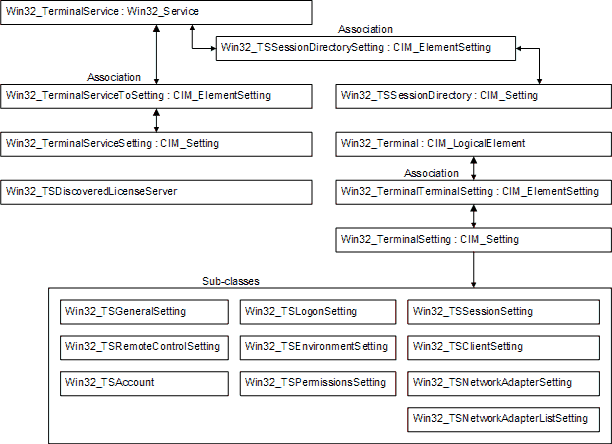

# Remote Desktop Services Configuration classes

The Remote Desktop Services Configuration WMI provider provides the following classes. An illustration follows.

## In this section

<dl> <dt>

[**CIM\_ElementSetting**](cim-elementsetting.md)
</dt> <dd>

Represents the association between managed system elements and the setting class defined for them.

</dd> <dt>

[**CIM\_LogicalElement**](cim-logicalelement.md)
</dt> <dd>

The base class for all system components that represent abstract system components, such as profiles, processes, or system capabilities, in the form of logical devices.

</dd> <dt>

[**CIM\_ManagedSystemElement**](cim-managedsystemelement.md)
</dt> <dd>

The base class for the system element hierarchy.

</dd> <dt>

[**CIM\_Setting**](cim-setting.md)
</dt> <dd>

Represents configuration-related and operational parameters for one or more managed system elements.

</dd> <dt>

[**Win32\_Terminal**](win32-terminal.md)
</dt> <dd>

represents a terminal.

</dd> <dt>

[**Win32\_TerminalError**](win32-terminalerror.md)
</dt> <dd>

Represents a terminal error.

</dd> <dt>

[**Win32\_TerminalService**](win32-terminalservice.md)
</dt> <dd>

a subclass of the [**Win32\_Service**](/windows/desktop/CIMWin32Prov/win32-service) class. [**Win32\_TerminalService**](win32-terminalservice.md) represents the **Element** property of the [**Win32\_TerminalServiceToSetting**](win32-terminalservicetosetting.md) association.

</dd> <dt>

[**Win32\_TerminalServiceSetting**](win32-terminalservicesetting.md)
</dt> <dd>

represents the configuration for a Remote Desktop Session Host (RD Session Host) server.

</dd> <dt>

[**Win32\_TerminalServiceToSetting**](win32-terminalservicetosetting.md)
</dt> <dd>

represents the association between an instance of the [**Win32\_TerminalService**](win32-terminalservice.md) class and the setting of a particular [**Win32\_TerminalServiceSetting**](win32-terminalservicesetting.md) property.

</dd> <dt>

[**Win32\_TerminalSetting**](win32-terminalsetting.md)
</dt> <dd>

represents the settings that can be applied to a terminal.

</dd> <dt>

[**Win32\_TerminalTerminalSetting**](win32-terminalterminalsetting.md)
</dt> <dd>

represents the association between a terminal and its configuration settings.

</dd> <dt>

[**Win32\_TSAccount**](win32-tsaccount.md)
</dt> <dd>

allows deletion of an account that exists on the [**Win32\_Terminal**](win32-terminal.md) and modification of existing permissions.

</dd> <dt>

[**Win32\_TSClientSetting**](win32-tsclientsetting.md)
</dt> <dd>

defines configuration settings for the [**Win32\_Terminal**](win32-terminal.md) class related to connection policy.

</dd> <dt>

[**Win32\_TSDiscoveredLicenseServer**](win32-tsdiscoveredlicenseserver.md)
</dt> <dd>

Provides details about the discovered Remote Desktop license server.

</dd> <dt>

[**Win32\_TSEnvironmentSetting**](win32-tsenvironmentsetting.md)
</dt> <dd>

defines the configuration settings for the [**Win32\_Terminal**](win32-terminal.md) class including initial program policy.

</dd> <dt>

[**Win32\_TSGeneralSetting**](win32-tsgeneralsetting.md)
</dt> <dd>

represents general settings of the terminal such as the encryption level and transport protocol.

</dd> <dt>

[**Win32\_TSLogonSetting**](win32-tslogonsetting.md)
</dt> <dd>

defines configuration settings for the [**Win32\_Terminal**](win32-terminal.md) class related to client logon.

</dd> <dt>

[**Win32\_TSNetworkAdapterListSetting**](win32-tsnetworkadapterlistsetting.md)
</dt> <dd>

enumerates the list of network adapters that can be configured for a [**Win32\_Terminal**](win32-terminal.md), based on the specified terminal protocol and transport method.

</dd> <dt>

[**Win32\_TSNetworkAdapterSetting**](win32-tsnetworkadaptersetting.md)
</dt> <dd>

defines various configuration settings for the [**Win32\_Terminal**](win32-terminal.md) class including properties related to the network adapter and the maximum number of connections allowed.

</dd> <dt>

[**Win32\_TSPermissionsSetting**](win32-tspermissionssetting.md)
</dt> <dd>

includes a method to add new accounts to the terminal and a method to restore the default permissions to a terminal.

</dd> <dt>

[**Win32\_TSRemoteControlSetting**](win32-tsremotecontrolsetting.md)
</dt> <dd>

defines the remote control configuration settings for the [**Win32\_Terminal**](win32-terminal.md) class.

</dd> <dt>

[**Win32\_TSSessionDirectory**](win32-tssessiondirectory.md)
</dt> <dd>

Defines the Remote Desktop Connection Broker (RD Connection Broker) configuration settings for the [**Win32\_TSSessionDirectorySetting**](win32-tssessiondirectorysetting.md) class.

</dd> <dt>

[**Win32\_TSSessionDirectorySetting**](win32-tssessiondirectorysetting.md)
</dt> <dd>

Represents the association between an instance of the [**Win32\_TerminalService**](win32-terminalservice.md) class and an instance of the [**Win32\_TSSessionDirectory**](win32-tssessiondirectory.md) class.

</dd> <dt>

[**Win32\_TSSessionSetting**](win32-tssessionsetting.md)
</dt> <dd>

defines configuration settings for the [**Win32\_Terminal**](win32-terminal.md) class such as time-limits, and disconnection and reconnection actions.

</dd> <dt>

[**Win32\_TSVirtualIP**](win32-tsvirtualip.md)
</dt> <dd>

Defines Internet protocol (IP) virtualization settings for a RD Session Host server.

</dd> <dt>

[**Win32\_TSVirtualIPSetting**](win32-tsvirtualipsetting.md)
</dt> <dd>

Represents the association between a [**Win32\_TerminalService**](win32-terminalservice.md) element class and a [**Win32\_TSVirtualIP**](win32-tsvirtualip.md) setting class.

</dd> </dl>

The following illustration shows the relationships between these classes.

 

 