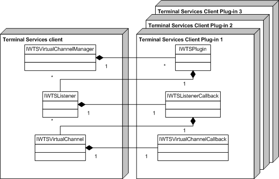

# Writing a Client DVC Module

To write a dynamic virtual channel (DVC) client module, you must first implement and register a Remote Desktop Connection (RDC) client plug-in. The DVC plug-in is an implementation of [**IWTSPlugin**](/windows/desktop/api/TsVirtualChannels/nn-tsvirtualchannels-iwtsplugin), registered as a Component Object Model (COM) object.

> [!Note]  
> The plug-in must be implemented in a free-threading model. Apartment-model implementation is not supported.

 

The following is a list of interfaces that are implemented by objects that are instantiated by the plug-in.

| Interface                                                        | Description                                                                                                                                                                                          |
|------------------------------------------------------------------|------------------------------------------------------------------------------------------------------------------------------------------------------------------------------------------------------|
| [**IWTSPlugin**](/windows/desktop/api/TsVirtualChannels/nn-tsvirtualchannels-iwtsplugin)                                 | Allows for the Remote Desktop Connection (RDC) client plug-in to be loaded by the Remote Desktop Connection (RDC) client.                                                                  |
| [**IWTSListenerCallback**](/windows/desktop/api/TsVirtualChannels/nn-tsvirtualchannels-iwtslistenercallback)             | Notifies the Remote Desktop Connection (RDC) client plug-in about incoming requests on a particular listener.                                                                              |
| [**IWTSVirtualChannelCallback**](/windows/desktop/api/TsVirtualChannels/nn-tsvirtualchannels-iwtsvirtualchannelcallback) | Receives notifications about channel state changes or data received. Each instance of this interface is associated with one instance of [**IWTSVirtualChannel**](/windows/desktop/api/TsVirtualChannels/nn-tsvirtualchannels-iwtsvirtualchannel).  |

 

The following is a list of interfaces that are implemented by objects that are instantiated by the Remote Desktop Connection (RDC) client, and are part of the framework.

| Interface                                                      | Description                                                                                                        |
|----------------------------------------------------------------|--------------------------------------------------------------------------------------------------------------------|
| [**IWTSVirtualChannelManager**](/windows/desktop/api/TsVirtualChannels/nn-tsvirtualchannels-iwtsvirtualchannelmanager) | Manages all Remote Desktop Connection (RDC) client plug-ins, DVC listeners, or static virtual channels.  |
| [**IWTSListener**](/windows/desktop/api/TsVirtualChannels/nn-tsvirtualchannels-iwtslistener)                           | Manages configuration settings for each listener for the DVC connection.                                 |
| [**IWTSVirtualChannel**](/windows/desktop/api/TsVirtualChannels/nn-tsvirtualchannels-iwtsvirtualchannel)               | Controls the channel state, as well as writes on the channel.                                            |

 

The following illustration shows the relationship between the Remote Desktop Connection (RDC) client and the Remote Desktop Connection (RDC) client plug-in.

 

 

