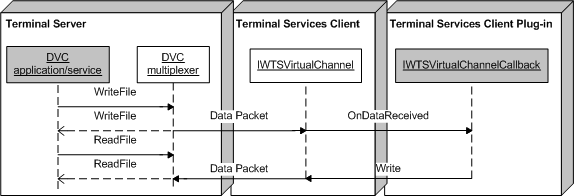

# Writing Data by Using a DVC Channel

Writing channel data by using a dynamic virtual channel (DVC) is symmetric for both the Remote Desktop Session Host (RD Session Host) server and the client. The writing of channel data is implemented by the [**Write**](/windows/desktop/api/TsVirtualChannels/nf-tsvirtualchannels-iwtsvirtualchannel-write) method of the [**IWTSVirtualChannel**](/windows/desktop/api/TsVirtualChannels/nn-tsvirtualchannels-iwtsvirtualchannel) interface.

The following illustration shows the sending and receiving of the data packet between the DVC client and server (DVC plug-in).

 

 

