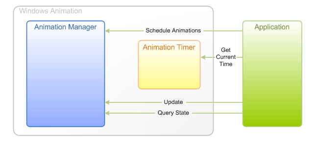
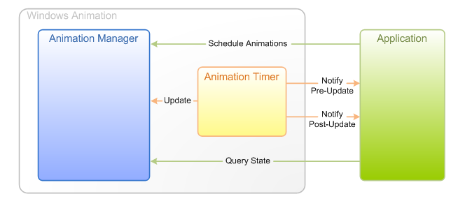
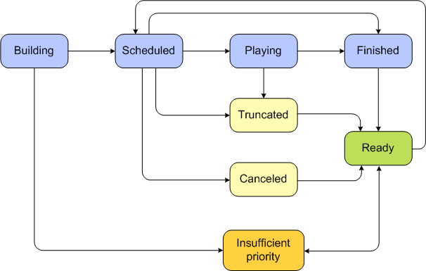

# Windows Animation Overview

This overview provides an introduction to the Windows Animation Manager and focuses on key components and concepts. For more information on storyboards and transitions, see [Storyboard Overview](storyboard-construction.md).

This topic contains the following sections:

-   [Basic Concepts](#basic-concepts)
-   [Components of Windows Animation](#components-of-windows-animation)
-   [The Windows Animation API](#the-windows-animation-api)
-   [Configurations](#configurations)
    -   [Application-Driven Animation](#application-driven-animation)
    -   [Timer-Driven Animation](#timer-driven-animation)
-   [Advanced Features](#advanced-features)
    -   [Contention Management](#contention-management)
-   [Related topics](#related-topics)

## Basic Concepts

*Animation* is a sequence of successive still images that produces an illusion of movement when played back. Using interactive animation in its user interface can give an application a unique personality as well as improve the user experience. Animation can help to communicate major state changes in the user interface and help to manage the complexity of the user interface. Animation can also add to the user's perception of the quality of an application.

As examples, Windows Animation is used in the taskbar to help you manage and access files and programs, and Magnifier to enlarge different parts of the screen to make them easier for users to see.

The fundamental units of an animation are the characteristic of a visual element to be animated and the description of how that characteristic changes over time. An application can animate a wide variety of characteristics such as position, color, size, rotation, contrast, and opacity.

In Windows Animation, an *animation variable* represents the characteristic to be animated. A *transition* describes how the value of that animation variable changes as animation occurs. For example, a visual element might have an animation variable that specifies its opacity, and a user action might generate a transition that takes that opacity from a value of 50 to 100, representing an animation from semi-transparent to fully opaque.

A *storyboard* is a set of transitions applied to one or more animation variables over time. An application displays animations by constructing and playing storyboards and then drawing sequences of discrete frames as the values of animation variables change over time.

## Components of Windows Animation

Windows Animation consists of the following components:

<dl> <dt>

animation manager
</dt> <dd>

Applications use an animation manager object to create animation variables and storyboards, schedule and control animations, and update state information before the application draws each frame. A single animation manager object typically manages all animations across an application and therefore has global control over all scheduled storyboards.

</dd> <dt>

animation variables
</dt> <dd>

Before starting any animations, an application needs to create animation variable objects. An animation variable represents one aspect of a visual element to be animated. The variable is a scalar floating-point value, although the value can be rounded to an integer value.

An animation variable typically has the same lifetime as the visual element it is to animate. The initial value of an animation variable is specified when the variable is created. Thereafter, its value cannot be changed directly; it must be updated through the animation manager.

An animation variable can be identified by a *tag*, which is a pairing of an integer identifier with a pointer to a COM object. A tag need not be unique, unless the application uses it to search for a variable. By default, an animation variable does not have a tag, and any attempts to read its tag will fail until one has been set.

</dd> <dt>

timing system
</dt> <dd>

Windows Animation includes a timing system that helps to ensure that animations are rendered at a frame rate that is smooth and consistent, while also reducing the use of system resources for rendering when the system is busy. A *timer* helps to manage animation rendering by automatically indicating the passage of a small unit of time, called a *tick*. The timing system monitors overall system rendering performance and *throttles* animations by dynamically increasing or decreasing the frequency of ticks. Applications can let a timer drive the animation manager and can register a handler to be notified before and after the manager is updated for each tick. Applications can specify the minimum acceptable animation frame rate for a timer and be notified if an animation's actual frame rate falls below this rate.

To conserve system resources, a timer can be configured to disable itself when no animation is taking place.

</dd> </dl>

## The Windows Animation API

The Windows Animation API is a single-threaded COM-based API that provides the following features for developers:

-   An animation manager object, [**UIAnimationManager**](/previous-versions/windows/desktop/legacy/dd317019(v=vs.85)), for creating animation objects and controlling animations
-   Animation variables and storyboards
-   A foundational library, [**UIAnimationTransitionLibrary**](/previous-versions/windows/desktop/legacy/dd317028(v=vs.85)), of ready-to-use transitions
-   A timer object, [**UIAnimationTimer**](/previous-versions/windows/desktop/legacy/dd317021(v=vs.85)), for determining the current time and, optionally, for driving animation
-   Event hooks for monitoring the state and progress of animation

For the complete API reference, see [Windows Animation Reference](windows-animation-reference.md). For example code, see [Windows Animation Tasks](using-windows-animation.md) and [Windows Animation Samples](windows-animation-samples.md).

## Configurations

Applications must get the current time before scheduling a new animation. The following are the timing mechanisms supported by Windows Animation:

-   [Application-Driven Animation](#application-driven-animation)
-   [Timer-Driven Animation](#timer-driven-animation)

### Application-Driven Animation

Applications using a hardware-accelerated graphics API can synchronize with the monitor refresh rate to render smooth animations. Alternately, an application may use a timing mechanism of its own to determine when to draw each frame of an animation. In either case, the application will tell the animation manager when to update its state. An animation timer can still be used to determine the current time with high precision, in the units required by the animation manager.

The following diagram shows the interactions between an application and the Windows Animation components when the application is driving animation updates directly.

In the simplest configuration, an application will redraw everything every time the screen is refreshed, even when no animations are playing. To avoid wasted work, an application can register a manager event handler to be notified when there are animations scheduled, and can detect when the schedule is empty so that it can stop redrawing.

### Timer-Driven Animation

Rather than updating the animation manager directly, applications may let the animation timer tell the animation manager when to update its state, and simply be notified when each update has taken place. This approach is recommended for older graphics APIs. In general, if it is possible to synchronize with the monitor refresh rate, it is better to do so and use application-driven animation.

The following diagram shows the interactions between an application and the Windows Animation components when the animation timer is driving animation updates.

The timer can be configured to run only when the animations are scheduled; doing so is a simple matter of passing a particular parameter when the timer and animation manager are connected.

## Advanced Features

Beyond a basic foundation to support animation, Windows Animation includes support for several advanced animation techniques, including:

<dl> <dt>

*context-sensitive duration*
</dt> <dd>

The duration of a transition need not be fixed; it can be determined based on the value and velocity of the animated variable when the transition begins.

</dd> <dt>

*velocity matching*
</dt> <dd>

Movement is generally more pleasing to the eye if a moving object's position and velocity do not jump instantaneously between values. When a new storyboard interrupts one that is currently playing, velocity matching enables the new storyboard to pick up smoothly where the previous one ended.

</dd> <dt>

*contention management*
</dt> <dd>

If two storyboards need to update the same animation variable simultaneously, a scheduling conflict occurs. Rather than requiring a specific numeric priority for each storyboard, Windows Animation enables the application to determine the relative priorities of any two storyboards.

</dd> </dl>

### Contention Management

Developers can implement a *priority comparison* callback to compare the priority of the storyboard of being scheduled and the storyboard that is already in the schedule. An application implementing a priority comparison can use any preferred logic to determine when a storyboard pre-empts another. To resolve the scheduling conflict, Windows Animation asks the application which of these actions may be taken, in the following order:

-   **Cancel the scheduled storyboard.** If the scheduled storyboard has not yet started to play, it might be canceled and immediately removed from the schedule.
-   **Trim the scheduled storyboard.** When a new storyboard trims a scheduled storyboard, the scheduled storyboard ceases to affect the variable as soon as the new storyboard begins to animate it. The velocities are matched, enabling the new storyboard to pick up smoothly where the previous one left off.
-   **Conclude the scheduled storyboard.** A storyboard may be concluded only if it contains a loop that repeats indefinitely. If the storyboard is in such a loop when concluded, the current repetition completes, and the remainder of the storyboard then plays. If the loop has not yet begun when a storyboard is concluded, the loop is skipped entirely.
-   **Compress the scheduled storyboard.** If trimming or canceling the scheduled storyboard is not an option, the storyboard is allowed to complete. Windows Animation introduces the possibility of compressing the time available for the scheduled storyboard (and any storyboards scheduled before it), so the variables reach their final state more quickly. When compression is applied, time is temporarily accelerated for affected storyboards, so they play faster.

If none of the above actions is allowed by the registered priority comparison objects, the attempt to schedule the new storyboard fails. By default, all storyboards can be trimmed, concluded, or compressed to prevent failure, but none can be canceled.

The following diagram shows the life cycle of a storyboard, using the states defined by the [**UI\_ANIMATION\_STORYBOARD\_STATUS**](/windows/win32/api/uianimation/ne-uianimation-ui_animation_storyboard_status) enumeration. Applications use the Windows Animation API to build a storyboard and submit it for scheduling. The animation manager schedules the storyboard and manages the animation.

For more information on storyboard scheduling and management, see [Storyboard Overview](storyboard-construction.md).

## Related topics

<dl> <dt>

[Windows Animation Reference](windows-animation-reference.md)
</dt> <dt>

[Windows Animation Samples](windows-animation-samples.md)
</dt> <dt>

[Windows Animation Tasks](using-windows-animation.md)
</dt> </dl>

 

 