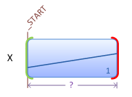

# Storyboard Overview

This overview focuses on how transitions and storyboards are used in Windows Animation. For an overview of the components of Windows Animation, see [Windows Animation Overview](scenic-animation-api-overview.md).

This topic contains the following sections:

-   [Transitions](#custom-transitions)
    -   [Transition Library](#transition-library)
    -   [Custom Transitions](#custom-transitions)
-   [Storyboards](#storyboards)
    -   [Building a Simple Storyboard](#building-a-simple-storyboard)
    -   [Using a Context-Sensitive Duration](#using-a-context-sensitive-duration)
    -   [Building a More Complex Storyboard](#building-a-more-complex-storyboard)
    -   [Using Keyframes](#using-keyframes)
    -   [Holding Variables](#holding-variables)
    -   [Scheduling a Storyboard](#scheduling-a-storyboard)
-   [Related topics](#related-topics)

## Transitions

A transition defines how a single animation variable changes over a particular time interval. Windows Animation includes a library of common transitions that developers can apply to one or more animation variables. Different kinds of transitions have different sets of parameters, which may include the value of the variable when the transition completes, the duration of the transition, or quantities unique to the underlying mathematical function, such as acceleration or range of oscillation.

All transitions share two implicit parameters: the initial value and initial velocity (slope) of the mathematical function. These may be specified explicitly by the application, but are typically set by the animation manager to the value and velocity of the animation variable when the transition begins.

-   [Transition Library](#transition-library)
-   [Custom Transitions](#custom-transitions)

### Transition Library

The following transitions are currently provided by the transition library. If an application requires an effect that cannot be specified by using the transition library, developers can create other kinds of transitions by implementing a custom interpolator for the application, or using a transition library from a third party.

| Transition Name                        | Description                                                                                                                                                                                          |
|----------------------------------------|------------------------------------------------------------------------------------------------------------------------------------------------------------------------------------------------------|
| accelerate-decelerate        | The animation variable speeds up and then slows down over a given duration.                                                                                                                |
| constant                     | The animation variable remains at its initial value throughout the transition.                                                                                                             |
| cubic                        | The animation variable changes from its initial value to a specified final value, with a specified final velocity, over a given duration.                                                  |
| discrete                     | The animation variable remains at its initial value for a specified delay time, then switches instantaneously to a specified final value and remains at that value for a given hold time.  |
| instantaneous                | The animation variable changes instantly from its current value to a specified final value.                                                                                                |
| linear                       | The animation variable transitions linearly from its initial value to a specified final value over a given duration.                                                                       |
| linear from speed            | The animation variable transitions linearly from its initial value to a specified final value with a specified speed.                                                                      |
| parabolic from acceleration  | The animation variable transitions from its initial value to a specified final value, with a specified final velocity, changing its velocity with a specified acceleration.                |
| reversal                     | The variable changes direction over a given duration. The final value will be the same as the initial value and the final velocity will be the negative of the initial velocity.           |
| sinusoidal from range        | The variable oscillates within a given range of values, with a specified period of oscillation, for a given duration.                                                                      |
| sinusoidal from velocity     | The variable oscillates with a specified period of oscillation, for a given duration. The amplitude of oscillation is determined by the variable's initial velocity.                       |
| smooth stop                  | The animation variable comes to a smooth stop at a specified final value, within a maximum duration of time.                                                                               |

 

The following table contains illustrations for each of these transitions.

|    Illustrations                                                                                                                                                                                                                                                                                                                                                                                                |
|----------------------------------------------------------------------------------------------------------------------------------------------------------------------------------------------------------------------------------------------------------------------------------------------------------------------------------------------------------------------------------------------------|
|          |
|                                                                                                                                            |
|                                                                                                                       |
|                                                                                                                                                                                                                                                                                                |

 

### Custom Transitions

An *interpolator* defines the mathematical function that determines how an animation variable changes over time as it progresses from its initial value to a final value. Each transition in the transition library has an associated interpolator object that is provided by the system and implements the interpolator function. If an application requires an effect that cannot be specified using the transition library, it can implement one or more custom transitions by implementing an interpolator object for each new transition. Interpolator objects cannot be used directly by applications and must instead be wrapped in an associated transition. A *transition factory* is used to generate transitions from an interpolator object. See [**IUIAnimationInterpolator**](/windows/desktop/api/UIAnimation/nn-uianimation-iuianimationinterpolator) and [**IUIAnimationTransitionFactory**](/windows/desktop/api/UIAnimation/nn-uianimation-iuianimationtransitionfactory) for more details.

Note that most applications will have all of the transitions they need by using the transition library, and therefore would not need to implement an interpolator.

## Storyboards

A storyboard is a collection of transitions applied to one or more animation variables over time. The transitions in a storyboard are guaranteed to remain synchronized relative to one another, and the storyboard is scheduled or canceled as a unit. After creating the desired transitions, an application creates a storyboard using the animation manager, adds the transitions to the storyboard, configures the storyboard appropriately, and schedules it to play as soon as possible. The animation manager determines the storyboard's actual start time, because there may be contention with other storyboards currently animating the same variables.

The overall duration of a storyboard depends on the durations of the transitions within the storyboard. The duration of a transition need not be fixed; it can be determined by the value and velocity of the animated variables when the transition begins. So, the duration of a storyboard can also depend on the state of the variables it animates.

The following examples assume that an animation manager, transition library, and timer have been created. For more information, see [Create the Main Animation Objects](adding-animation-to-an-application.md). The examples also assume that the application has created three animation variables (X, Y and Z) by using the [**IUIAnimationManager::CreateAnimationVariable**](/windows/desktop/api/UIAnimation/nf-uianimation-iuianimationmanager-createanimationvariable) method, and five transitions (T1, T2, T3, T4, and T5) by using the one of the methods of the [**IUIAnimationTransitionLibrary**](/windows/desktop/api/UIAnimation/nn-uianimation-iuianimationtransitionlibrary) interface.

-   [Building a Simple Storyboard](#building-a-simple-storyboard)
-   [Using a Context-Sensitive Duration](#using-a-context-sensitive-duration)
-   [Building a More Complex Storyboard](#building-a-more-complex-storyboard)
-   [Using Keyframes](#using-keyframes)
-   [Holding Variables](#holding-variables)
-   [Scheduling a Storyboard](#scheduling-a-storyboard)

### Building a Simple Storyboard

To build a simple storyboard, use the [**IUIAnimationManager::CreateStoryboard**](/windows/desktop/api/UIAnimation/nf-uianimation-iuianimationmanager-createstoryboard) method to create a new storyboard, the [**IUIAnimationTransitionLibrary::CreateLinearTransition**](/windows/desktop/api/UIAnimation/nf-uianimation-iuianimationtransitionlibrary-createlineartransition) method to create a linear transition, T1, and the [**IUIAnimationStoryboard::AddTransition**](/windows/desktop/api/UIAnimation/nf-uianimation-iuianimationstoryboard-addtransition) method to apply the T1 transition to the variable X and add the resulting transition to the storyboard.

This process yields a simple storyboard, as shown in the following figure. The storyboard contains one transition, T1, such that the value of variable X changes linearly over a fixed duration of time.

Note that for such a simple scenario, an alternative option is to use the [**IUIAnimationManager::ScheduleTransition**](/windows/desktop/api/UIAnimation/nf-uianimation-iuianimationmanager-scheduletransition) method.

### Using a Context-Sensitive Duration

While some transitions have a fixed duration, the duration of others depends on the initial value or velocity of the animated variable when the transition begins. For example, the [**IUIAnimationTransitionLibrary::CreateLinearTransitionFromSpeed**](/windows/desktop/api/UIAnimation/nf-uianimation-iuianimationtransitionlibrary-createlineartransitionfromspeed) method creates a transition with a duration that is proportional to the difference between the initial value of the animation variable and the specified final value. In this illustration, and the remaining illustrations, such transitions with arbitrary durations are shown with a question mark (?), and their actual durations are determined when the storyboard plays.

### Building a More Complex Storyboard

After creating a storyboard and adding a single transition, T1, you can append a second transition for the X variable by calling the [**IUIAnimationStoryboard::AddTransition**](/windows/desktop/api/UIAnimation/nf-uianimation-iuianimationstoryboard-addtransition) method again, but with T2 instead of T1.

Assuming that the T2 transition has a duration that is context-sensitive, the storyboard now contains two back-to-back transitions of arbitrary duration affecting the variable X.

Calling [**AddTransition**](/windows/desktop/api/UIAnimation/nf-uianimation-iuianimationstoryboard-addtransition) again with variable Y and transition T3 adds a third transition at the start of the storyboard. Depending on the values of X and Y when the storyboard plays, T3 may end after T1 or even after T2.

### Using Keyframes

To add a transition at an offset from the start of the storyboard, you must first add a keyframe. Keyframes represent instants in time and by themselves have no effect on the behavior of the storyboard. Every storyboard has an implicit keyframe representing the start of the storyboard, [**UI\_ANIMATION\_KEYFRAME\_STORYBOARD\_START**](/previous-versions/windows/desktop/legacy/dd756780(v=vs.85)); you can add new keyframes at offsets from the start by calling the [**IUIAnimationStoryboard::AddKeyframeAtOffset**](/windows/desktop/api/UIAnimation/nf-uianimation-iuianimationstoryboard-addkeyframeatoffset) method with **UI\_ANIMATION\_KEYFRAME\_STORYBOARD\_START**.

The offset at which you add a keyframe is always relative to another keyframe. The following diagram shows the result of adding keyframe1 and transition T4, which is applied to variable Z, aligned with keyframe1, and created with a fixed duration. Of course, because the durations of the other transitions are not yet known, T4 might not be the last transition to finish.

Keyframes can also be placed at the ends of transitions, using the [**IUIAnimationStoryboard::AddKeyframeAfterTransition**](/windows/desktop/api/UIAnimation/nf-uianimation-iuianimationstoryboard-addkeyframeaftertransition) method. The following diagram shows the result of adding keyframe2 after T1 and keyframe3 after T2.

Because the durations of T1 and T2 are not known until the storyboard plays, the offsets of keyframe2 and keyframe3 also are not determined until then. Consequently, keyframe2 and even keyframe3 can occur earlier than keyframe1.

Both the start and end of a transition can be aligned with keyframes by using the [**IUIAnimationStoryboard::AddTransitionBetweenKeyframes**](/windows/desktop/api/UIAnimation/nf-uianimation-iuianimationstoryboard-addtransitionbetweenkeyframes) method. The following diagram shows the result of adding a fifth transition, T5, on variable Y, between keyframe2 and keyframe3. This alters the duration of T5, making it longer or shorter depending on the relative offsets of keyframe2 and keyframe3.

### Holding Variables

If T4 does end after T2 and T5, the storyboard stops animating variables X and Y, making them available for other storyboards to animate. However, the application can call the [**IUIAnimationStoryboard::HoldVariable**](/windows/desktop/api/UIAnimation/nf-uianimation-iuianimationstoryboard-holdvariable) method to request that the storyboard hold some or all of the variables it animates at their final values until the storyboard has completed. The following diagram shows the result of holding X and Z when T4 finishes last. Notice that the storyboard holds X at its final value until the storyboard has completed. The hold has no effect on Z because the storyboard ends when T4 finishes.

Even though Y is not held by this storyboard, its value does not change after T5 completes unless another storyboard animates it. Because Y is not held, any other storyboard, regardless of priority, can animate Y after T5 has finished. In contrast, because X is held, a lower-priority storyboard cannot animate X until this storyboard is finished.

All of these illustrations have assumed an arbitrary set of current values for the variables when the storyboard starts playing. If other values are encountered, the durations of the context-sensitive transitions are likely to be different, as shown in the following illustration.

In this scenario, T5 begins before T3 has finished, and T3 is therefore trimmed. Because T4 finishes earlier than T2 and T5, the value of Z is held until the end of the storyboard. In general, the values and velocities of variables when a storyboard starts playing can affect keyframe ordering and the overall length and shape of the storyboard.

### Scheduling a Storyboard

When scheduling a storyboard, its start time is determined by its outline and the outlines of the storyboards that are currently in the schedule. Specifically, the first and last moments when the storyboard animates each individual variable determine whether and when two storyboards collide, but the internal details of the transitions within are not important.

The following illustration shows the outline of a storyboard with five transitions animating three variables.

A cornerstone of the Windows Animation platform is its support for letting one animation complete before another begins, when necessary. While this eliminates many logical problems, it also introduces arbitrary latency in the UI. To address this, applications can specify the *longest acceptable delay* for a storyboard to start, using the [**IUIAnimationStoryboard::SetLongestAcceptableDelay**](/windows/desktop/api/UIAnimation/nf-uianimation-iuianimationstoryboard-setlongestacceptabledelay) method, and the animation manager uses this information to schedule the storyboard before the specified latency period elapses. When a storyboard is scheduled, the animation manager determines if other storyboards must first be canceled, trimmed, concluded, and/or compressed.

An application can register a handler that will be called when a storyboard's status changes. This enables the application to respond when the storyboard starts playing, runs to completion, is removed entirely from the schedule, or is prevented from completing due to interruption by a higher-priority storyboard. To identify the storyboards passed to storyboard event handlers (or priority comparisons), an application can use the [**IUIAnimationStoryboard::SetTag**](/windows/desktop/api/UIAnimation/nf-uianimation-iuianimationstoryboard-settag) method to apply tags to storyboards, similar to those that can be used to identify variables. As with storyboard re-use, developers must exercise caution when using tags to identify storyboards, and be sure that ambiguities do not arise when user actions result in many storyboards being queued.

The following examples show two variations of an attempt to schedule the storyboard built in the earlier sections of this topic.

In this scenario, six storyboards, A through F, have already been scheduled to animate variables W, X, Y and Z, but only A and B have started playing. The new storyboard, labeled G, has its longest acceptable delay set to the duration shown in the following illustration.

The application has registered priority comparisons that include the following logic:

-   G can cancel only C and E, and only to prevent failure.
-   G can trim only A, C, E and F, and only to prevent failure.
-   Any storyboard can compress any other storyboard (compression is always done only to prevent failure).

> [!Note]  
> The qualifier "only to prevent failure" means that the registered priority comparisons return S\_OK only when the *priorityEffect* parameter is **UI\_ANIMATION\_PRIORITY\_EFFECT\_FAILURE**. See the [**IUIAnimationPriorityComparison::HasPriority**](/windows/desktop/api/UIAnimation/nf-uianimation-iuianimationprioritycomparison-haspriority) method for details.

 

To start G before the longest acceptable delay has elapsed, the animation manager must do the following:

-   Trim F
-   Cancel E

When E is canceled, D and F are uncovered and revert to their original outlines:

The animation manager does not need to cancel or trim C to schedule before its longest acceptable delay has elapsed, so the meeting of C and G determines when G starts.

After G has been successfully scheduled, the durations of its transitions can be determined, and the remainder of its outline is therefore known. However, the outline can change if another storyboard is subsequently removed from the schedule.

As a second example, consider a scenario like that above, but with a shorter longest acceptable delay specified for G.

In this case, the following actions are taken:

-   Trim F
-   Cancel E
-   Cancel C

Also, the animation manager must compress D by the amount shown to enable G to start after its longest acceptable delay, and no later.

To preserve their relative timing, A, B, and F are compressed as well.

However, storyboards on unrelated variables (not shown) would not be compressed.

Once again, the outline of G is now known and is different from the result in the first scenario because the variables have different values when G begins.

## Related topics

<dl> <dt>

[**IUIAnimationManager**](/windows/desktop/api/UIAnimation/nn-uianimation-iuianimationmanager)
</dt> <dt>

[**IUIAnimationPriorityComparison**](/windows/desktop/api/UIAnimation/nn-uianimation-iuianimationprioritycomparison)
</dt> <dt>

[**IUIAnimationStoryboard**](/windows/desktop/api/UIAnimation/nn-uianimation-iuianimationstoryboard)
</dt> <dt>

[**IUIAnimationTransitionLibrary**](/windows/desktop/api/UIAnimation/nn-uianimation-iuianimationtransitionlibrary)
</dt> </dl>

 

