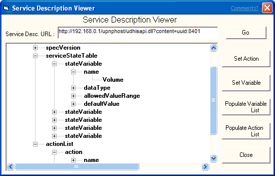
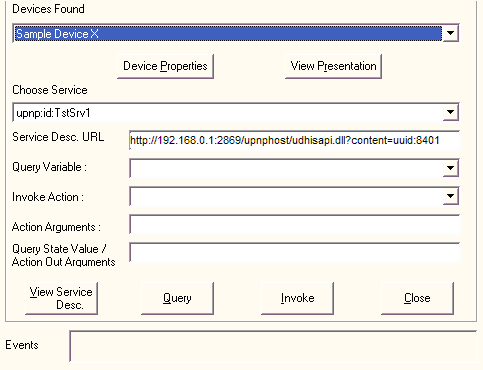

# Controlling a Device

Once you have discovered devices, you can control them.

**To view device properties**

1.  Select a device from the **Devices Found** list.
2.  Click **Device Properties**. The **Device Properties** window appears with the requested information.

> [!Note]  
> The **View Presentation** functionality is not available in the C++ sample code.

 

**To view a device's presentation page**

1.  Select a device from the **Devices Found** list.
2.  Click **View Presentation**. An Internet Explorer window appears with the requested presentation page.

> [!Note]  
> The **View Service Desc.** functionality is not available in the C++ sample code.

 

**To view a service description**

1.  You can enter the URL to the service description in the **Service Desc. URL** field.

    

2.  Click **View Service Desc.** The **Service Description Viewer** window is displayed. You can then browse the service description using the tree view. This functionality is not available in the C++ sample code.

    

    There are five commands you can use in the Service Description Viewer window.

| Button                 | Action Performed                                                                                                                                                                      |
|------------------------|---------------------------------------------------------------------------------------------------------------------------------------------------------------------------------------|
| Go                     | Loads the file shown in the **Service Desc. URL** field.                                                                                                                              |
| Set Action             | Select an action name in the service description tree and click **Set Action**. The action name is entered into the **Invoke Action** field of the main **Generic UCP** window.       |
| Set Variable           | Select a variable name in the service description tree and click **Set Variable**. The variable name is entered into the **Query Variable** field of the main **Generic UCP** window. |
| Populate Variable List | Loads all the service's variable names into the **Query Variable** list of the main **Generic UCP** window.                                                                           |
| Populate Action List   | Loads all the service's action names into the **Invoke Action** list of the main **Generic UCP** window.                                                                              |

 

**To control a device**

1.  From the **Devices Found** list, select the device you want to control.
2.  From the **Choose Service** list, select the service you want to invoke or state variable you want to query.

    

    > [!Note]  
    > The contents of the **Service List** is based on the device selected in the **Devices Found** list.

     

3.  If you want to find out the value of a state variable for the selected service, enter the variable name in the **Query Variable** field for service. Click **Query**. The results are shown in the **Query State Value/Action Out Arguments** field.
4.  If you want to invoke an action for a service, enter the action name in the **Invoke Action** field, and any arguments in the **Action Arguments** field. Click **Invoke**. The results are shown in the **Query State Value/Action Out Arguments** field, if any.

    The return value, if any, is contained in the first out argument.

    > [!Note]  
    > If there are multiple arguments for an action, separate them with spaces.

     

5.  View eventing information in the **Events** field for the selected service.

 

 

