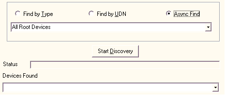

# Discovering Devices

You can search for devices in three ways: by type, by UDN, and by asynchronous search (which is a search by device type).

**To discover devices**

1.  Select the type of search you want to use: **Find by Type**, **Find by UDN**, or **Async Find**.
2.  Select the type of device or the UDN you want to find from the list (for searches by type or by UDN). The contents of the list is based on the contents of the udn.txt and devtype.txt files you edited earlier.
3.  Click **Start Discovery**. The search is started. The results are displayed in the **Devices Found** list. If no devices are found, a message is displayed indicating this condition. The status of the search progress is displayed in the **Status** field.

When you use the asynchronous search, new devices that are found are displayed in the **Devices Found** list and in the **Status** bar. When the asynchronous search is finished, the **Status** bar displays a message noting this. However, because an asynchronous search runs until it is manually stopped, new devices appear in the **Devices Found** list and the **Status** bar as the devices appear on the network.

Once you have discovered devices, you can [control them](controlling-a-device.md).

 

 

