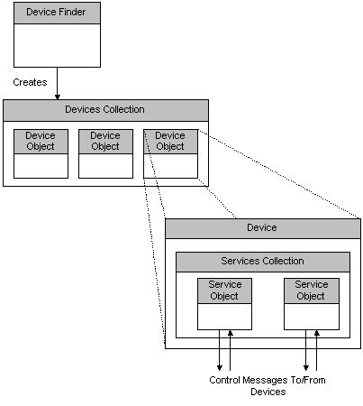

# What is the Control Point Object Model?

The following illustration shows the basic Control Point object model.

Searching for devices with the Device Finder interface creates a Devices collection. A Devices collection contains zero or more Device objects. Applications can use the various Devices collection methods to access individual Device objects.

Device objects always contain a Services collection that contains one or more Service objects. These service objects are used by applications to communicate with and control devices.

 

 

