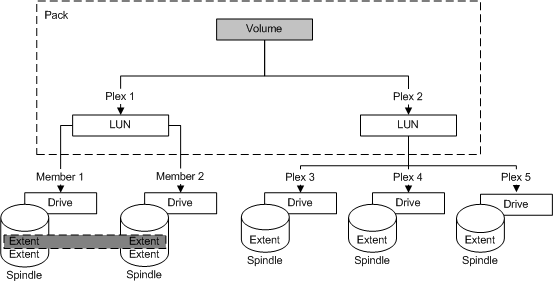

# Configuration Stacking

\[Beginning with Windows 8 and Windows Server 2012, the [Virtual Disk Service](virtual-disk-service-portal.md) COM interface is superseded by the [Windows Storage Management API](/previous-versions/windows/desktop/stormgmt/windows-storage-management-api-portal).\]

Stacking involves the concatenating of a set of logical block mappings. You can stack multiple LUNs from the same subsystem under one LUN. You can stack a LUN together with volumes from the same pack under one volume. Further, you can stack multiple LUNs that are surfaced by heterogeneous subsystems under one volume.

As the following illustration shows, the creating of a volume does not change the existing binding of a contributing LUN. Similarly, the unbinding of a volume does not unbind a contributing LUN. The illustration depicts the RAID 0 1 (0+1) configuration. This well-known configuration combines striping (RAID 0) and mirroring (RAID 1), which pairs the fast data access of RAID 0 with the reliability of RAID 1.

Contributing LUNs can have different binding types. Many configurations are possible with VDS but are highly unlikely, such as the next illustration. In this example, one volume plex is a striped LUN and the other is a three-way mirrored LUN.

Although impractical, this example illustrates an important aspect of stacking. Because stacking concatenates plexes, VDS adds the three LUN plexes to the two volume plexes for a total of five plexes.

 

 
