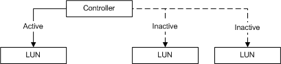

# Controller Object

\[Beginning with Windows 8 and Windows Server 2012, the [Virtual Disk Service](virtual-disk-service-portal.md) COM interface is superseded by the [Windows Storage Management API](/previous-versions/windows/desktop/stormgmt/windows-storage-management-api-portal).\]

A controller object models a controller in a subsystem. Controllers are contained by subsystems, and each controller has one or more controller ports through which the host computer can write to and read from LUNs. A single controller can be simultaneously set to active for one LUN and inactive for others. A controller that is active for a specified LUN carries the responsibility for handling input to and output from the LUN. The following figure illustrates this idea.

**VDS 1.0:** Each of a subsystem's controllers is set to either active or inactive in relation to each of the LUNs the subsystem surfaces.

VDS applications use the [**IVdsSubSystem::QueryControllers**](/windows/desktop/api/Vds/nf-vds-ivdssubsystem-querycontrollers) method to determine the controllers that are contained by a specific subsystem. Callers can get a pointer to a specific controller by selecting the desired controller object from the enumeration that is returned by the **QueryControllers** method. With a controller object, a caller can set the controller status, query for its associated LUNs, query for its controller ports, and flush and invalidate the cache.

In addition to an object identifier, a name, and a serial number, controller object properties include the controller status and health, and a count of the ports.

The following table lists related interfaces, enumerations, and structures.

| Type                                                                                              | Element                                                                                                                        |
|---------------------------------------------------------------------------------------------------|--------------------------------------------------------------------------------------------------------------------------------|
| Interfaces that are always exposed by this object                                                 | [**IVdsController**](/windows/desktop/api/Vds/nn-vds-ivdscontroller)                                                                                       |
| Interfaces that are always exposed by this object in VDS 1.1 and 2.0 Fibre Channel providers only | [**IVdsControllerControllerPort**](/windows/desktop/api/Vds/nn-vds-ivdscontrollercontrollerport)                                                           |
| Interfaces that may be exposed by this object                                                     | [**IVdsMaintenance**](/windows/desktop/api/Vds/nn-vds-ivdsmaintenance)                                                                                     |
| Associated enumerations                                                                           | [**VDS\_CONTROLLER\_STATUS**](/windows/desktop/api/Vds/ne-vds-vds_controller_status).                                                                      |
| Associated structures                                                                             | [**VDS\_CONTROLLER\_PROP**](/windows/desktop/api/Vds/ns-vds-vds_controller_prop) and [**VDS\_CONTROLLER\_NOTIFICATION**](/windows/desktop/api/Vds/ns-vds-vds_controller_notification). |

 

## Related topics

<dl> <dt>

[Hardware Provider Objects](hardware-provider-objects.md)
</dt> <dt>

[**IVdsSubSystem::QueryControllers**](/windows/desktop/api/Vds/nf-vds-ivdssubsystem-querycontrollers)
</dt> </dl>

 

 
