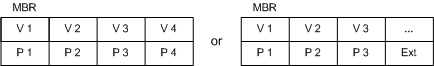
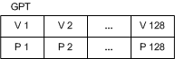
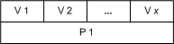

# Disk Object

\[Beginning with Windows 8 and Windows Server 2012, the [Virtual Disk Service](virtual-disk-service-portal.md) COM interface is superseded by the [Windows Storage Management API](/previous-versions/windows/desktop/stormgmt/windows-storage-management-api-portal).\]

A disk object models a host-based, physical disk. The software provider that is running on the local host can access a LUN as a disk when the LUN object is unmasked to the local host. For more information about LUN masking, see the [LUN Object](lun-object.md).

Each disk object contributes to exactly one pack object; however, a disk can contribute extents to any number of volumes within a pack. You can designate a disk to be a hot spare.

## Partition-to-Volume Mapping

The operating system includes support for both basic and dynamic disks. VDS supplies a basic provider and a dynamic provider to manage these disk types. Basic disks are never fault tolerant. Dynamic disks can be fault tolerant if the operating system permits such volume binding. Basic and dynamic disks can contain partitions that are structured according to one of the following partition styles: master boot record (MBR) or GUID partition table (GPT). MBR partitioning has up to four primary partitions, or three primary partitions plus one extended partition having infinite logical drives. GPT partitioning provides up to 128 primary partitions.

The description that follows is general in nature. It shows the typical relationship between partitions and volumes, to which there are several exceptions. For a detailed description of partition-to-volume mapping, see the [**IVdsAdvancedDisk**](/windows/desktop/api/Vds/nn-vds-ivdsadvanceddisk) interface. Partition-to-volume mapping varies depending on the type of disk, basic or dynamic.

-   Basic disks

    A partition on a basic disk maps directly to a volume, in most cases, and can be styled as an MBR or GPT partition. The following illustration shows the mapping for both versions of MBR partitions. In the first case, partitions (P1 through P4) map directly to volumes (V1 through V4). An extended partition (Ext) replaces P4 in the second MBR style. The number of logical drives inside the extended partition that map to volumes is unlimited.

    

    The GPT partitions (P1 through P128) in the next illustration map directly to volumes (V1 through V128), if all available partitions are in use. A GPT disk does not make use of an extended partition as a way to enhance usability.

    

-   Dynamic disks

    A special partition type on a dynamic disk maps to a large number of volumes. For an estimated limit that is imposed by the dynamic provider, see the [pack object](pack-object.md). As the following illustration shows, there can be any number of extents inside P1 that map to volumes.

    

Regardless of the disk type, a disk can contain one or more disk extents. A disk extent is a contiguous range of logical blocks exposed by the disk. For example, a disk extent can represent an entire volume, one portion of a spanned volume, one member of a striped volume, or one plex of a mirrored volume.

### Working with Disks

Use the [**IVdsPack::AddDisk**](/windows/desktop/api/Vds/nf-vds-ivdspack-adddisk) method to add a disk to an existing pack. Callers can get a pointer to a specific disk by selecting the desired disk object from the enumeration that is returned by the [**IVdsPack::QueryDisks**](/windows/desktop/api/Vds/nf-vds-ivdspack-querydisks) method. Likewise, you can invoke the [**IVdsDisk::GetPack**](/windows/desktop/api/Vds/nf-vds-ivdsdisk-getpack) method to determine which pack contains a given disk.

You can move a disk from one pack to another by calling the [**IVdsPack::MigrateDisks**](/windows/desktop/api/Vds/nf-vds-ivdspack-migratedisks) method. (VDS does not support migrating a basic disk between packs controlled by the basic provider.) You can also move a pack to another host by physically moving all disks in the pack to the new host. The pack moves with the disks and appears as a foreign pack on the new host. For instructions, see [Adding Foreign Disks to a Pack](adding-foreign-disks-to-a-pack.md).

In addition to an object identifier, a name, an address, a device type, and a media type, disk object properties include the disk status, health, and flags; the size in bytes, bytes per sector, sectors per track, and tracks per cylinder; and the bus and partition type.

The following table lists related interfaces, enumerations, and structures.

| Type                                              | Element                                                                                                                                                                                                                                                                                                                                                                                                                                                                                                                                                                                                                                                                                                                                                                                                                                                                                                                                                                                                                                                                |
|---------------------------------------------------|------------------------------------------------------------------------------------------------------------------------------------------------------------------------------------------------------------------------------------------------------------------------------------------------------------------------------------------------------------------------------------------------------------------------------------------------------------------------------------------------------------------------------------------------------------------------------------------------------------------------------------------------------------------------------------------------------------------------------------------------------------------------------------------------------------------------------------------------------------------------------------------------------------------------------------------------------------------------------------------------------------------------------------------------------------------------|
| Interfaces that are always exposed by this object | [**IVdsDisk**](/windows/desktop/api/Vds/nn-vds-ivdsdisk), [**IVdsDiskOnline**](/windows/desktop/api/Vds/nn-vds-ivdsdiskonline), [**IVdsAdvancedDisk**](/windows/desktop/api/Vds/nn-vds-ivdsadvanceddisk), [**IVdsAdvancedDisk2**](/windows/desktop/api/Vds/nn-vds-ivdsadvanceddisk2), [**IVdsDiskPartitionMF**](/windows/desktop/api/Vds/nn-vds-ivdsdiskpartitionmf), [**IVdsDiskPartitionMF2**](/windows/desktop/api/Vds/nn-vds-ivdsdiskpartitionmf2), and [**IVdsCreatePartitionEx**](/windows/desktop/api/Vds/nn-vds-ivdscreatepartitionex).**Windows Server 2008:** The [**IVdsDiskPartitionMF2**](/windows/desktop/api/Vds/nn-vds-ivdsdiskpartitionmf2) interface is not supported.  **Windows Vista:** The [**IVdsDiskOnline**](/windows/desktop/api/Vds/nn-vds-ivdsdiskonline) interface is not supported until Windows Vista with Service Pack 1 (SP1); use [**IVdsDisk2**](/windows/desktop/api/Vds/nn-vds-ivdsdisk2) instead. The [**IVdsDiskPartitionMF2**](/windows/desktop/api/Vds/nn-vds-ivdsdiskpartitionmf2) interface is not supported.  **Windows Server 2003:** The [**IVdsAdvancedDisk2**](/windows/desktop/api/Vds/nn-vds-ivdsadvanceddisk2), [**IVdsDisk2**](/windows/desktop/api/Vds/nn-vds-ivdsdisk2), [**IVdsDiskOnline**](/windows/desktop/api/Vds/nn-vds-ivdsdiskonline), [**IVdsDiskPartitionMF**](/windows/desktop/api/Vds/nn-vds-ivdsdiskpartitionmf), and [**IVdsDiskPartitionMF2**](/windows/desktop/api/Vds/nn-vds-ivdsdiskpartitionmf2) interfaces are not supported.  |
| Interfaces that may be exposed by this object     | [**IVdsRemovable**](/windows/desktop/api/Vds/nn-vds-ivdsremovable). (See [LUN Object](lun-object.md) for additional interfaces that are exposed if the disk is a LUN.)                                                                                                                                                                                                                                                                                                                                                                                                                                                                                                                                                                                                                                                                                                                                                                                                                                                                                                                  |
| Associated enumerations                           | [**VDS\_DISK\_FLAG**](/windows/desktop/api/Vds/ne-vds-vds_disk_flag), [**VDS\_DISK\_STATUS**](/windows/desktop/api/Vds/ne-vds-vds_disk_status), [**VDS\_PARTITION\_FLAG**](/windows/desktop/api/Vds/ne-vds-vds_partition_flag), [**VDS\_PARTITION\_STYLE**](/windows/win32/api/vds/ne-vds-__vds_partition_style), and [**VDS\_DISK\_EXTENT\_TYPE**](/windows/desktop/api/Vds/ne-vds-vds_disk_extent_type).                                                                                                                                                                                                                                                                                                                                                                                                                                                                                                                                                                                                                                                                                                                                                                                                     |
| Associated structures                             | [**VDS\_DISK\_PROP**](/windows/desktop/api/Vds/ns-vds-vds_disk_prop), [**VDS\_DISK\_NOTIFICATION**](/windows/desktop/api/Vds/ns-vds-vds_disk_notification), [**VDS\_INPUT\_DISK**](/windows/desktop/api/Vds/ns-vds-vds_input_disk), [**VDS\_PARTITION\_PROP**](/windows/desktop/api/Vds/ns-vds-vds_partition_prop), [**VDS\_PARTITION\_INFO\_GPT**](/windows/desktop/api/Vds/ns-vds-vds_partition_info_gpt), [**VDS\_PARTITION\_INFO\_MBR**](/windows/desktop/api/Vds/ns-vds-vds_partition_info_mbr), and [**VDS\_DISK\_EXTENT**](/windows/desktop/api/Vds/ns-vds-vds_disk_extent).                                                                                                                                                                                                                                                                                                                                                                                                                                                                                                                                                                                                                                                                                        |

 

## Related topics

<dl> <dt>

[Software Provider Objects](software-provider-objects.md)
</dt> <dt>

[Pack Object](pack-object.md)
</dt> <dt>

[LUN Object](lun-object.md)
</dt> <dt>

[Adding Foreign Disks to a Pack](adding-foreign-disks-to-a-pack.md)
</dt> </dl>

 

